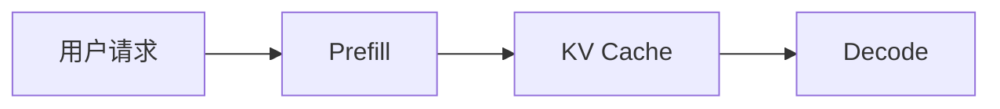

# 教程写作规范

## 目标读者

计算机科学本科生。默认读者理解基本操作系统、网络、Python、深度学习概念，但不熟悉大模型推理服务（LLM serving）、KV cache、vLLM 或 Mooncake。

## 风格

- 中文为主，必要英文术语保留原文。
- 先解释“为什么有这个问题”，再解释“系统怎么解决”。
- 课程顺序要从读者的第一个问题开始，而不是从项目最核心的技术点开始。例如先讲“一个 prompt 如何变成回答”，再讲 KV cache、vLLM、Mooncake。
- 每课只解决一个主问题。第一课回答“推理请求如何生成回答”，第二课回答“为什么 KV cache 会变成系统问题”。
- 首次提出关键术语前，必须先给出可读解释；可以在正文当前上下文中解释，也可以链接到 `glossary.md` 中已经解释过的小节。
- 不允许先裸露术语、后文再解释。比如正文第一次出现 `logits` 时，必须写成“[`logits`](glossary.md#logits)，也就是模型对候选 token 给出的原始分数”，不能等到后面的 sampling 小节才解释。
- 术语链接本身不等于解释。首次出现时优先采用“术语链接 + 一句话解释”的形式。
- 图表、表格、代码入口和外部阅读说明里出现的新术语，也要在图表后说明、表格前说明或就地括号解释。
- 不把源码细节作为入口。
- 遇到代码，只说明“这段代码在系统中负责什么”。
- 代码块是纯文本，不会渲染 Markdown 链接。代码块中只写可读文本，术语解释放在代码块前后。
- 每期正文约 1500 字，不含图表和代码路径表。
- 控制解释密度：保留关键背景，删除重复展开。
- 不设置“思考题”部分；如需检查理解，只在正文中加入短小检查点。
- 外部阅读材料要说明“读哪几篇、为什么读、和本课如何对应”，不要只贴链接。

## 图表要求

优先使用 Mermaid：

每张图后必须有 3-5 行解释，说明图中组件的职责和箭头含义。

## 每期必须回答

- 这一期解决哪个问题？
- 读者应该记住哪 3 个概念？
- 哪些代码以后需要查？
- 哪些问题留到下一期？

## 发布前检查

- 标题和开头没有直接抛出未解释术语。
- 第一次出现的关键术语已经就地解释，或链接并解释到 `glossary.md`。
- 新增术语已经同步进入 `glossary.md`。
- Mermaid 图后的说明覆盖了图里的关键节点和箭头。
- `text` 代码块里没有 Markdown 链接语法。
- 代码入口表格里的缩写、组件名和路径用途已经解释。
- 小结中的术语不是第一次出现；如果必须出现，补链接和解释。
- 推荐阅读顺序、外部阅读和术语表都已同步更新。
