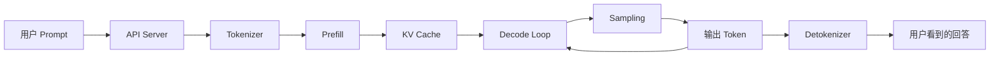

# 01: 从用户输入到回答：大模型推理的基本流程

## 本期目标

本期补齐大模型推理服务的入门背景。大模型推理服务指模型已经训练好之后，在线接收用户请求并生成回答的服务。目标是回答一个最朴素的问题：用户输入一个 [`prompt`](glossary.md#prompt)，也就是给模型的文本指令或上下文之后，系统怎么一步步把它变成模型回答？

读完本期，你应该能把一次推理请求拆成几个关键阶段：请求进入服务、文本变成 [`token`](glossary.md#token)、模型执行 [`prefill`](glossary.md#prefill)、逐步 [`decode`](glossary.md#decode)、通过 [`sampling`](glossary.md#sampling) 选择下一个 token，最后把 token 还原成文本返回给用户。

## 背景问题

平时我们看到的是一个很简单的交互：

```text
用户：解释一下模型推理中的中间缓存
模型：这种中间缓存可以帮助模型少做重复计算 ...
```

但推理系统看到的不是“自然语言句子”，而是一批请求、[`token`](glossary.md#token)、[`tensor`](glossary.md#tensor) 和缓存块。这里的 tensor 是深度学习中表示输入、中间状态和输出的多维数组，缓存块则是系统管理缓存时使用的一段固定大小空间。大模型也不是一次性写完整段回答。更准确地说，它每次根据已有上下文预测“下一个 token 的概率分布”，系统再从这个概率分布里选出一个 token，把它接到上下文后面，然后继续预测下一个 token。

所以，一段回答本质上是很多次“预测下一个 token”的循环结果。这是理解 [`vLLM`](glossary.md#vllm)、[`KV cache`](glossary.md#kv-cache) 和 [`Mooncake`](glossary.md#mooncake) 的前提：vLLM 是大模型推理服务引擎，KV cache 是模型读过上下文后留下的中间缓存，Mooncake 则和 KV cache 的传输、存储和复用有关。

## 核心图解



这张图描述了一次文本生成请求的主路径。[`API Server`](glossary.md#api-server) 是接收用户请求的服务入口；[`Tokenizer`](glossary.md#tokenizer) 把文本切成 token id；[`prefill`](glossary.md#prefill) 让模型读完整个 prompt，并产生初始 [`KV cache`](glossary.md#kv-cache)；`Decode Loop` 是反复执行 [`decode`](glossary.md#decode) 的循环，用来持续生成新 token。每生成一个 token，系统会更新上下文和 KV cache，并把 token 交给 [`Detokenizer`](glossary.md#detokenizer) 还原成用户可读的文本。

## 文本为什么要变成 Token

大模型不能直接处理 Unicode 字符串，也就是计算机里按统一编码表示的原始文本。模型输入通常是整数序列，每个整数代表词表里的一个 token。`Tokenizer` 的职责就是把文本变成 token id，也就是词表中 token 对应的整数编号，例如：

```text
"KV cache 很重要" -> [12345, 678, 91011, ...]
```

token 不一定等于一个中文词、一个英文单词或一个字符。它可能是一个常见词片段，也可能只是几个字节的组合。对推理系统来说，token 数量非常关键，因为上下文长度、计算量、KV cache 大小和输出成本都直接跟 token 数有关。

这也是为什么同样一句话，在不同模型或 tokenizer 下可能有不同的 token 数。服务层做限长、计费、调度和缓存时，通常都要先知道请求对应多少 token。

## Prefill：模型先读完 prompt

[`prefill`](glossary.md#prefill) 阶段可以理解为“模型读题”。用户输入的 prompt 可能有几百、几千甚至上万 token。模型需要把这些 token 一次性或分批送过 [`Transformer`](glossary.md#transformer) 层，也就是大模型里反复堆叠的主干计算层，并计算每一层 [`attention`](glossary.md#attention) 需要的中间状态。attention 是让当前位置关注上下文中相关位置的机制。

这个阶段会产生两类重要结果：

- 最后一个位置上的 [`logits`](glossary.md#logits)，也就是模型对词表中候选 token 给出的原始分数，用来预测第一个输出 token。
- 每一层 attention 的 key/value tensor，也就是 [`KV cache`](glossary.md#kv-cache)。

prefill 通常计算量大，因为它要处理完整 prompt。长上下文请求的首 token 延迟，很多时候就花在这个阶段。后续课程把 KV cache 放在核心位置，就是因为 prefill 产生的这些中间状态会决定 decode 阶段能不能高效继续。

## Decode：回答是逐 token 长出来的

[`decode`](glossary.md#decode) 阶段可以理解为“模型写答案”。和 prefill 不同，decode 通常每轮只处理新生成的一个或少量 token。模型会利用已有 KV cache，避免重新计算完整历史上下文。

一个简化的 decode 循环如下。这里的 [`logits`](glossary.md#logits) 指模型对候选 token 给出的原始分数：

```text
1. 根据当前上下文和 KV cache 计算下一个 token 的 logits
2. 用 sampling 策略选出一个 token
3. 把新 token 追加到上下文
4. 更新 KV cache
5. 如果遇到结束条件，就停止；否则回到第 1 步
```

这解释了两个常见现象。第一，流式输出时，用户会看到回答一点点出现，因为系统确实是在逐 token 生成。第二，生成越长，decode 循环越久，请求占用的 KV cache 也越多。

## Sampling：模型不是直接吐字

模型每一步输出的是词表上所有 token 的分数，通常叫 [`logits`](glossary.md#logits)。系统需要把这些分数变成一个具体 token，这一步叫 [`sampling`](glossary.md#sampling)。

如果总是选概率最高的 token，结果更稳定，但也可能死板。如果引入 `temperature`、`top_p`、`top_k` 等参数，系统会在高概率候选里保留一定随机性：`temperature` 用来调节分布的尖锐程度，`top_p` 只保留累计概率达到阈值的一组候选，`top_k` 只保留概率最高的 k 个候选。回答可能更丰富，但也更不稳定。

因此，推理服务不仅是“跑模型 forward”，也就是执行一次模型前向计算。它还要处理用户传入的生成参数，维护每个请求的停止条件，例如最大输出长度、停止词、EOS token，以及是否需要返回 logprobs。EOS token 是表示生成结束的特殊 token，logprobs 是候选 token 的对数概率信息。

## 推理服务为什么比单次前向计算复杂

单个请求的流程已经不短，而在线服务面对的是很多请求同时到来。系统必须决定：

- 哪些请求可以合成一个 [`batch`](glossary.md#batch) 一起跑，也就是合并成一组共同执行？
- 长 prompt 和短 prompt 如何排队？
- 谁正在 prefill，谁正在 decode？
- [`显存`](glossary.md#显存) 里的 KV cache 够不够？显存是 GPU 或 NPU 等加速设备上的内存。
- 输出 token 要怎样流式返回给不同客户端？

这就是 [`vLLM`](glossary.md#vllm) 这类 [`LLM serving engine`](glossary.md#llm-serving-engine) 要解决的问题。LLM serving engine 是大模型推理服务引擎，不只是调用模型做 [`forward`](glossary.md#forward)，还要做调度、[`batching`](glossary.md#batching)、内存管理、KV cache 管理和 API 协议适配。forward 指模型前向计算，batching 指把多个请求或 token 组织成 batch 一起执行。

## 和 KV Cache 的关系

现在可以回到下一期的主角：KV cache。

如果没有 KV cache，每次 decode 新 token 时，模型都需要重新处理从 prompt 到当前输出的完整上下文。这样生成第 100 个 token 时，就要重复计算前面 99 个输出 token 和整个 prompt，成本会非常高。

有了 KV cache，系统可以把历史上下文在每一层 attention 里的 key/value 保存下来。decode 阶段只需要为新 token 增量计算，并复用历史 KV。这就是大模型推理能持续生成长回答的关键优化。

但优化也带来新的系统问题：KV cache 会占用大量 [`显存`](glossary.md#显存)，也就是 GPU 或 NPU 等加速设备上的内存；请求越多、上下文越长，占用越大。单机里要管理 [`KV block`](glossary.md#kv-block)，也就是固定大小的 KV cache 缓存块；分布式里还要考虑 KV 怎么跨节点移动和复用。这正是下一期从 KV cache 进入 vLLM、[`vLLM Ascend`](glossary.md#vllm-ascend) 和 Mooncake 的原因。

## 代码入口

本期仍然不要求逐行读源码。以后查细节时，可以从这些入口开始：

| 问题 | 代码入口 |
| --- | --- |
| vLLM OpenAI API 入口。这里的 OpenAI API 指兼容 OpenAI 请求格式的服务接口 | `repos/vllm/vllm/entrypoints/openai/` |
| 请求参数与生成参数，例如 temperature、top_p、top_k 这类控制 sampling 的参数 | `repos/vllm/vllm/sampling_params.py` |
| vLLM 输出对象，也就是 vLLM 返回给调用方的结果结构 | `repos/vllm/vllm/outputs.py` |
| vLLM V1 engine 主路径。V1 engine 是 vLLM 中一套较新的推理引擎实现路径 | `repos/vllm/vllm/v1/` |
| Rust server OpenAI 路由。Rust 是 vLLM 部分服务端路径使用的系统编程语言 | `repos/vllm/rust/src/server/src/routes/openai/` |

这些入口不是本期的阅读任务，只是为了把概念和源码位置先挂上钩。

## 外部阅读材料

- [从零开始理解大模型](https://github.com/GitHubxsy/nanoAgent/blob/book/llm/README.md)：适合作为本期的配套阅读。建议先读第 1 篇到第 5 篇，建立“预测下一个 token”、Token、Embedding、Attention 和 Transformer 的直觉；[`Embedding`](glossary.md#embedding) 指把 token id 映射成向量，Attention 和 Transformer 可对照本文前面的解释。之后再读第 7 篇“推理——你按下回车后的这一秒发生了什么”，和本期内容互相对照。

## 小结

本期只需要记住三点：

1. 大模型生成回答不是一次性写完，而是反复预测下一个 token。
2. 一次请求通常经过 tokenizer 切分文本、prefill 读入 prompt、decode 逐步生成、sampling 选择 token、detokenizer 还原文本这些阶段。
3. [`KV cache`](glossary.md#kv-cache) 是 prefill 和 decode 之间的关键中间状态，也是后续理解 [`vLLM`](glossary.md#vllm)、[`vLLM Ascend`](glossary.md#vllm-ascend) 和 [`Mooncake`](glossary.md#mooncake) 的入口。

下一期会正式进入 KV cache：它为什么占 [`显存`](glossary.md#显存)，为什么会影响 [`throughput`](glossary.md#throughput) 和 [`latency`](glossary.md#latency)，以及 Mooncake 为什么会出现在这条数据通路上。
