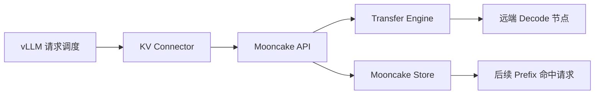

# 03: Mooncake 的整体架构与数据通路

## 本期目标

上一期已经说明 [`KV cache`](glossary.md#kv-cache)，也就是模型读完上下文后留下的 key/value 中间缓存，为什么会从模型优化变成系统资源问题。本期开始把主角切到 [`Mooncake`](glossary.md#mooncake)：Mooncake 是面向大模型推理系统的数据传输和缓存组件，重点解决 KV cache 如何移动、存储和复用。

本期只回答一个问题：一次 KV cache 从推理服务产生之后，会经过 Mooncake 的哪些组件，最后被谁消费？

## 背景问题

在单机推理里，KV cache 通常留在同一个进程、同一张加速卡或同一台机器上。[`decode`](glossary.md#decode) 阶段需要它时，直接从本地 [`显存`](glossary.md#显存) 或内存读取即可。这里的 decode 指模型逐 token 生成输出的阶段，显存指 GPU 或 NPU 等加速设备上的内存。

问题出现在服务规模变大之后。推理系统可能把 [`prefill`](glossary.md#prefill) 和 decode 拆到不同节点；prefill 是处理 prompt 并生成初始 KV cache 的阶段。也可能希望多个请求复用相同 [`prefix`](glossary.md#prefix) 的 KV cache；prefix 是请求开头的一段共享上下文。这时 KV cache 不再只是模型内部变量，而是一个需要被定位、传输、保存和回收的数据对象。

Mooncake 的位置就在这里：它不负责模型如何算 logits，也不负责决定下一个 token；它负责让大块 KV cache 在进程、机器、设备和存储层之间可靠地流动。

## 核心图解

这张图从推理服务视角描述 Mooncake 的数据通路。[`vLLM`](glossary.md#vllm) 是大模型推理服务引擎，`KV Connector` 是 vLLM 接入外部 KV 传输或存储能力的抽象。Mooncake API 把上层请求转换成 Mooncake 能理解的数据操作。`Transfer Engine` 负责移动数据，`Mooncake Store` 负责保存和复用数据。箭头表示 KV cache 或它的元数据在组件之间流动。

## Mooncake 的三类职责

第一类职责是传输。Mooncake 中的 [`Transfer Engine`](glossary.md#transfer-engine)，也就是负责在内存、设备和机器之间高效移动数据的组件，会处理内存注册、远端地址定位、传输提交和状态查询。KV cache 很大，不能把它当成普通字符串或小 JSON 传来传去。

第二类职责是存储。[`Mooncake Store`](glossary.md#mooncake-store) 是 Mooncake 中作为分布式 KV cache 存储层的组件。它把 KV cache 看成对象，围绕 key、segment、replica、lease 和淘汰策略管理缓存。这里的 key 是对象名字，segment 是可管理的连续存储空间，replica 是同一对象的一份副本，lease 是防止对象在使用中被提前回收的租约。

第三类职责是集成。上层系统不会直接操作 Mooncake 的所有底层细节，而是通过 vLLM connector、Python binding 或其他接口把 KV buffer 交给 Mooncake。这里的 buffer 指保存 KV cache 的一段内存区域。

## 两条主路径

第一条路径是点对点传输。[`P2P`](glossary.md#p2p) 是 point-to-point，也就是两个节点、进程或设备之间直接移动数据。在 [`PD disaggregation`](glossary.md#pd-disaggregation) 场景中，prefill 和 decode 被拆开部署，prefill 节点生成 KV cache 后，decode 节点需要尽快拿到它。Mooncake 的传输路径更关注时效性，因为 decode 正在等待数据继续生成。

第二条路径是共享缓存池。[`KV Pool`](glossary.md#kv-pool) 是保存和管理 KV cache 的缓存池。多个请求如果拥有相同 prefix，就可能从 Mooncake Store 中加载已经计算过的 KV cache，减少重复 prefill。这个路径更关注复用性和容量管理。

两条路径都依赖数据定位。系统必须知道 KV cache 在哪个节点、哪个 segment、哪个偏移、长度是多少、是否仍然有效。没有这些元数据，传输引擎即使有高带宽也不知道该搬什么。

## 代码入口

| 问题 | 代码入口 |
| --- | --- |
| Mooncake 总体设计文档，先看组件关系 | `repos/Mooncake/docs/source/design/architecture.md` |
| Transfer Engine 对外接口 | `repos/Mooncake/mooncake-transfer-engine/include/transfer_engine.h` |
| Mooncake Store 设计文档 | `repos/Mooncake/docs/source/design/mooncake-store.md` |
| vLLM 与 Mooncake 集成说明 | `repos/Mooncake/docs/source/getting_started/examples/vllm-integration/` |

## 小结

本期只需要记住三点：

1. Mooncake 的主线是围绕 KV cache 做传输、存储和复用。
2. Transfer Engine 偏向“把数据搬过去”，Mooncake Store 偏向“把数据存起来以后复用”。
3. vLLM 和 vLLM Ascend 是 Mooncake 的重要调用方，但本教程后续会优先从 Mooncake 自身机制展开。

下一期进入 Transfer Engine：为什么 KV cache 传输需要 segment、内存注册和 batch transfer。
