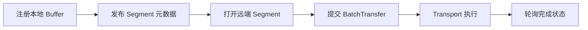

# 04: Transfer Engine：KV cache 如何被移动

## 本期目标

上一期把 [`Mooncake`](glossary.md#mooncake) 拆成传输、存储和集成三类职责。本期聚焦 [`Transfer Engine`](glossary.md#transfer-engine)：Transfer Engine 是 Mooncake 中负责在内存、设备和机器之间高效移动数据的组件。

本期只回答一个问题：为什么移动 [`KV cache`](glossary.md#kv-cache) 不能简单理解成一次普通拷贝？

## 背景问题

KV cache 是 Transformer attention 产生的 key/value tensor 缓存。这里的 [`Transformer`](glossary.md#transformer) 是大模型主干结构，[`attention`](glossary.md#attention) 是让当前位置关注上下文中相关位置的机制，[`tensor`](glossary.md#tensor) 是深度学习中的多维数组。对于长上下文请求，KV cache 可能达到 GB 级别。

如果这份数据从 [`prefill`](glossary.md#prefill) 节点移动到 [`decode`](glossary.md#decode) 节点，系统不仅要知道“数据内容是什么”，还要知道“数据在哪段内存里、远端是否可访问、应该走哪个传输后端、传输是否完成”。prefill 指处理 prompt 并生成初始 KV cache 的阶段，decode 指逐 token 生成输出的阶段。

所以 Transfer Engine 处理的是一个系统问题：把一段高性能内存中的大对象，以尽量少的 CPU 拷贝和尽量高的带宽交给另一端。

## 核心图解

这张图描述 Transfer Engine 的典型传输流程。`Buffer` 是保存数据的一段连续内存区域；[`Segment`](glossary.md#segment) 是 Transfer Engine 能识别的一组可访问地址范围；[`BatchTransfer`](glossary.md#batchtransfer) 是一批读写传输任务。[`Transport`](glossary.md#transport) 是具体传输机制，例如 TCP、RDMA 或设备侧传输；TCP 是通用网络传输协议，RDMA 是远程直接内存访问技术。箭头表示一次传输从准备地址信息到完成数据移动的顺序。

## Segment：先让地址可被理解

普通程序里的指针只在本进程有意义。远端机器看到一个地址数字，并不能直接知道它属于谁、能不能读写、该走哪张网卡。因此 Transfer Engine 需要 segment 这个抽象。

Segment 可以理解为“这个进程对外声明的一组可传输地址范围”。当应用调用 `registerLocalMemory` 时，Transfer Engine 会把本地 buffer 纳入可传输范围，并把必要元数据交给 metadata service。这里的 metadata service 指保存集群传输元数据的服务，例如 etcd、Redis 或 HTTP metadata server。

远端通过 `openSegment` 打开某个名字对应的 segment，拿到可以用于传输的句柄。句柄不是直接的数据，而是后续提交传输任务时用来定位远端地址的引用。

## BatchTransfer：一次传输不是一个字节流

KV cache 往往不是单个连续逻辑对象。它可能按层、按 block、按并行分片组织，实际内存也可能是多段不连续地址。Transfer Engine 用 BatchTransfer 表示一批读写请求，每个请求描述源地址、目标 segment、目标偏移、长度和读写方向。

这样做有两个好处。第一，系统可以把多段小传输合并提交，减少调度开销。第二，底层 transport 可以根据任务列表做切片、并行和重试，而不是让上层自己管理每个碎片。

## Transport：同一个接口，不同硬件路径

[`Transport`](glossary.md#transport) 是数据传输通道或传输机制。Transfer Engine 支持多种后端，例如 `TcpTransport`、`RdmaTransport`、`NvlinkTransport`、`IntraNodeNvlinkTransport` 和 Ascend 相关 transport。TCP 更通用，RDMA 更适合跨节点高带宽低 CPU 开销，[`NVLink`](glossary.md#nvlink) 是 NVIDIA GPU 之间的高速互联，更偏向同机 GPU 之间的数据移动。

对上层来说，理想情况是只提交“我要把这些地址范围搬到那里”。至于走哪条链路、怎样注册内存、如何处理连接和状态，应该由 Transfer Engine 和 transport 后端处理。

## 代码入口

| 问题 | 代码入口 |
| --- | --- |
| Transfer Engine C++ 对外接口 | `repos/Mooncake/mooncake-transfer-engine/include/transfer_engine.h` |
| Segment 和传输元数据 | `repos/Mooncake/mooncake-transfer-engine/include/transfer_metadata.h` |
| 多 transport 管理 | `repos/Mooncake/mooncake-transfer-engine/include/multi_transport.h` |
| Transport 基类和传输请求结构 | `repos/Mooncake/mooncake-transfer-engine/include/transport/transport.h` |
| Transfer Engine 设计文档 | `repos/Mooncake/docs/source/design/transfer-engine/index.md` |

## 小结

本期只需要记住三点：

1. Transfer Engine 移动的是已注册内存中的大块数据，不是普通应用层消息。
2. Segment 解决“远端如何理解我的地址范围”，BatchTransfer 解决“一批传输任务如何提交”。
3. Transport 把统一传输接口映射到 TCP、RDMA、NVLink 或 Ascend 等具体硬件路径。

下一期会把这套传输能力放回推理场景：prefill 节点生成的 KV cache 如何交给 decode 节点。
