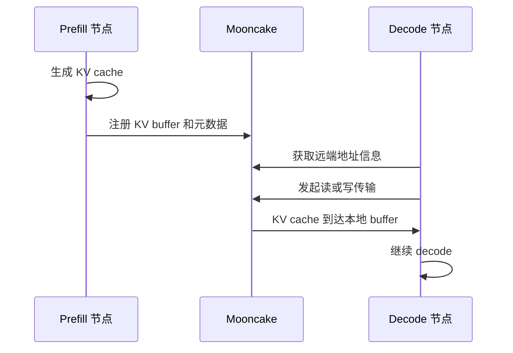

# 05: P2P KV 传输：Prefill 到 Decode

## 本期目标

上一期介绍了 [`Transfer Engine`](glossary.md#transfer-engine)，也就是 Mooncake 中负责高效移动数据的组件。本期把它放回推理服务场景，聚焦 [`P2P`](glossary.md#p2p) KV 传输。P2P 是 point-to-point，指两个节点、进程或设备之间直接移动数据。

本期只回答一个问题：在 [`PD disaggregation`](glossary.md#pd-disaggregation)，也就是 prefill 和 decode 拆开部署的架构中，prefill 节点生成的 [`KV cache`](glossary.md#kv-cache) 怎样交给 decode 节点？

## 背景问题

[`prefill`](glossary.md#prefill) 是处理 prompt 并生成初始 KV cache 的阶段，[`decode`](glossary.md#decode) 是逐 token 生成输出的阶段。两者计算特征不同：prefill 更像大块并行计算，decode 更像低延迟循环。把它们拆开后，系统可以分别优化资源，但必须解决一个新问题：decode 节点启动生成前，需要拿到 prefill 节点已经算好的 KV cache。

如果 decode 拿不到这份 KV cache，它只能等待、重算或失败。等待会增加 [`latency`](glossary.md#latency)，也就是请求耗时；重算会浪费算力；失败会破坏服务可用性。因此 P2P KV 传输关注的是“当前请求的 KV 能不能及时到达”。

## 核心图解

这张图描述当前请求的 P2P KV 传输。`KV buffer` 是保存 KV cache 的内存区域；元数据包括远端节点、地址偏移、长度和请求标识。Decode 节点不是重新计算 prompt，而是通过 Mooncake 找到 prefill 节点生成的 KV cache，再把它读入本地可用 buffer。

## 请求级传输和缓存复用不同

P2P KV 传输服务的是“这一次请求”。它的关键指标是时效性：decode 节点正在等待 KV cache，传输慢就会直接增加首 token 延迟。首 token 延迟指用户发出请求后看到第一个输出 token 的等待时间。

这和后面要讲的 [`Prefix Cache`](glossary.md#prefix-cache) 不同。Prefix Cache 是针对相同或相似 prefix 复用已有 KV cache 的缓存机制，更关注后续请求是否命中缓存。P2P 传输不一定把 KV 长期保存起来，它首先要把当前请求需要的数据送到正确位置。

## 元数据为什么重要

P2P 传输不是只传一个文件名。系统要知道远端 `engine_id`、请求 id、远端 block 列表、host、port、并行分片信息和 KV cache 的 token 范围。这里的 `engine_id` 可以理解为推理实例的身份标识，请求 id 是一次用户请求的标识，block 列表描述 KV cache 在缓存块中的位置。

这些信息通常由上层推理引擎通过 [`connector`](glossary.md#connector) 传给 Mooncake。connector 是 vLLM 中用于通过外部系统移动或加载 KV cache 的抽象。Mooncake 根据这些信息决定要访问哪个 segment、搬哪些地址范围，以及传输完成后如何通知上层。

## 成功、失败和回退

成功路径很直接：prefill 节点准备好 KV cache，decode 节点按元数据加载，随后继续生成。失败路径更复杂。可能 metadata service 不可达，远端 segment 尚未打开，KV buffer 没注册，传输超时，或者 decode 节点拿到的 block 信息不匹配。

推理系统必须决定失败后如何处理。常见选择包括等待重试、让请求回退到本地重算、或直接返回错误。Mooncake 提供传输能力，但策略通常由上层 serving 系统结合请求状态决定。

## 代码入口

| 问题 | 代码入口 |
| --- | --- |
| vLLM 中 Mooncake P2P connector 路径 | `repos/vllm/vllm/distributed/kv_transfer/kv_connector/v1/mooncake/` |
| vLLM Ascend 中 Mooncake P2P connector | `repos/vllm-ascend/vllm_ascend/distributed/kv_transfer/kv_p2p/mooncake_connector.py` |
| Mooncake Transfer Engine Python binding | `repos/Mooncake/mooncake-integration/transfer_engine/transfer_engine_py.cpp` |
| Mooncake vLLM PD 集成文档 | `repos/Mooncake/docs/source/getting_started/examples/vllm-integration/disagg-prefill-decode.md` |

## 小结

本期只需要记住三点：

1. P2P KV 传输解决的是当前请求从 prefill 到 decode 的 KV cache 交接。
2. 传输必须依赖请求级元数据，否则 decode 节点不知道该从哪里加载哪些 KV block。
3. P2P 路径重视时效性，和后续面向长期复用的 Mooncake Store 路径不同。

下一期进入 Mooncake Store：KV cache 如何被放入共享缓存池，供后续请求复用。
