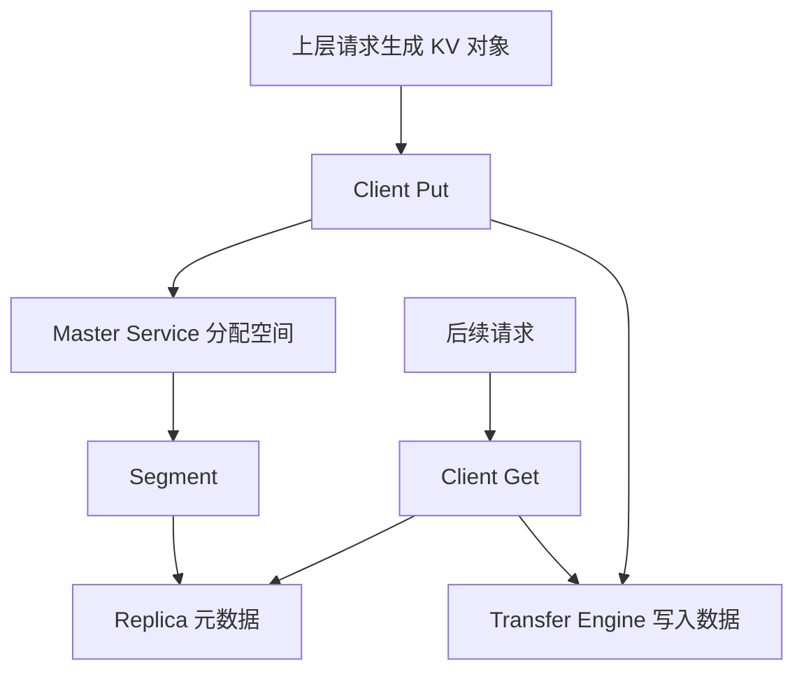

# 06: Mooncake Store 与 KV Pool

## 本期目标

上一期讲的是 [`P2P`](glossary.md#p2p) KV 传输，也就是当前请求的 [`KV cache`](glossary.md#kv-cache) 如何从 prefill 节点交给 decode 节点。本期切到另一条 Mooncake 主线：[`Mooncake Store`](glossary.md#mooncake-store)。Mooncake Store 是 Mooncake 中作为分布式 KV cache 存储层的组件。

本期只回答一个问题：Mooncake Store 如何把 KV cache 变成可管理、可查询、可复用的缓存对象？

## 背景问题

P2P 传输更像“把这次请求的数据送过去”。但很多推理服务还有另一类需求：把已经计算过的 KV cache 保存起来，让后续请求复用。比如多个请求使用相同系统提示词，或者多轮对话共享很长的开头上下文。如果每次都重新 [`prefill`](glossary.md#prefill)，也就是重新处理 prompt 并生成初始 KV cache，会浪费大量计算。

[`KV Pool`](glossary.md#kv-pool) 是保存和管理 KV cache 的缓存池。Mooncake Store 可以被理解为一种分布式 KV Pool：它把 KV cache 当成对象来管理，围绕对象 key、缓存空间、副本、租约和淘汰策略工作。这里的对象 key 是查找缓存对象的名字，副本是同一份对象的多份存放结果，租约是防止对象使用中被回收的保护机制。

## 核心图解

这张图描述 Mooncake Store 的基本角色。`Client` 是发起 Put 和 Get 的客户端逻辑；`Master Service` 是管理元数据和空间分配的服务；[`Segment`](glossary.md#segment) 是可管理的连续存储空间；[`Replica`](glossary.md#replica) 是对象的一份副本。Put 写入数据并登记元数据，Get 查询元数据并把数据读回。

## Store 为什么不是普通缓存

Redis 或 Memcached 这类通用缓存通常把 value 当成普通字节串。Mooncake Store 面向的是大模型推理中的 KV cache，它的对象可能很大，可能来自 GPU 或 NPU 显存，也可能需要跨节点直接传输。这里的 [`NPU`](glossary.md#npu) 是神经网络处理器，GPU 是常见深度学习加速设备。

因此 Mooncake Store 需要和 Transfer Engine 协作。元数据由 Master Service 管理，真正的大块数据移动由 Transfer Engine 完成。这样控制流和数据流分开：控制流决定对象在哪里、是否有效、能不能分配空间；数据流负责把 KV cache 搬到目标 segment。

## Segment、Replica 和对象

[`Segment`](glossary.md#segment) 在 Store 语境下可以理解为一个客户端挂载给 Store 管理的连续空间。Master Service 知道有哪些 segment、每个 segment 还有多少空间、哪些对象副本放在里面。

[`Replica`](glossary.md#replica) 是同一个对象的一份可读取副本。多个 replica 可以缓解热点访问，也可以在某个节点不可用时提供其他读取选择。Store 会维护对象到 replica 的映射，Get 请求会根据这些信息选择合适副本。

对象本身可以是完整 KV cache，也可以是上层系统拆分后的某个 KV block 或分片。Mooncake Store 不需要理解每个 token 的语义，它只需要可靠管理对象的字节内容和元数据。

## 代码入口

| 问题 | 代码入口 |
| --- | --- |
| Mooncake Store 设计文档 | `repos/Mooncake/docs/source/design/mooncake-store.md` |
| Store 客户端接口抽象 | `repos/Mooncake/mooncake-store/include/pyclient.h` |
| Store 真实客户端实现 | `repos/Mooncake/mooncake-store/include/real_client.h` |
| Master Service 元数据管理 | `repos/Mooncake/mooncake-store/include/master_service.h` |
| Segment 和基础类型 | `repos/Mooncake/mooncake-store/include/types.h` |

## 小结

本期只需要记住三点：

1. Mooncake Store 把 KV cache 当成可查询、可复用的缓存对象管理。
2. Master Service 管理元数据和空间，Transfer Engine 负责大块数据移动。
3. Segment 是可分配空间，Replica 是对象副本，它们共同支撑分布式 KV Pool。

下一期继续 Store 路径：什么时候后续请求能通过 prefix cache 复用已有 KV cache。
