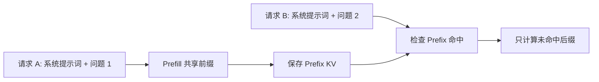

# 07: Prefix Cache：什么时候能复用 KV

## 本期目标

上一期介绍了 [`Mooncake Store`](glossary.md#mooncake-store)，也就是 Mooncake 中作为分布式 KV cache 存储层的组件。本期聚焦 [`Prefix Cache`](glossary.md#prefix-cache)：Prefix Cache 是针对相同或相似 [`prefix`](glossary.md#prefix) 复用已有 [`KV cache`](glossary.md#kv-cache) 的缓存机制。prefix 是请求开头的一段共享上下文。

本期只回答一个问题：什么情况下后续请求可以复用之前已经计算好的 KV cache？

## 背景问题

大模型推理中的 [`prefill`](glossary.md#prefill) 阶段会处理完整 prompt 并生成初始 KV cache。prompt 是用户输入给模型的文本指令或上下文。如果两个请求开头完全相同，那么这部分 token 经过模型后产生的 KV cache 也可以复用。这样后续请求不用重新计算共享前缀，可以减少首 token 延迟和计算成本。

但是复用不能只靠“文本看起来像”。推理系统通常按 [`token`](glossary.md#token) 判断缓存命中。token 是模型词表中的基本输入输出单位。同一段文本在不同 tokenizer 下可能对应不同 token 序列；这里的 tokenizer 是把文本转换为 token id 的组件。因此 Prefix Cache 的前提是 token 级 prefix 能匹配。

## 核心图解

这张图描述 prefix cache 的基本收益。请求 A 先计算共享前缀并保存 KV cache；请求 B 到来后，如果开头 token 序列命中已有缓存，就加载这部分 KV cache。随后系统只需要计算请求 B 独有的后缀。箭头表示 KV cache 从“已计算结果”变成“后续请求输入状态”。

## 命中条件

第一，模型和 tokenizer 必须一致。KV cache 是某个模型在某组 token 上产生的中间状态，不能跨模型随意复用，也不能跨不同 tokenizer 的 token 序列复用。

第二，生成参数和上下文边界要兼容。通常 prefill 阶段的共享前缀 KV 只依赖输入 token 和模型权重，但上层系统还要确保 block 划分、位置编码、并行配置和缓存布局一致。这里的 block 指推理系统管理 KV cache 的固定大小缓存块。

第三，缓存对象仍然有效。Mooncake Store 可能因为空间压力淘汰对象，也可能因为租约过期、节点故障或副本状态不完整导致不能读取。命中不仅是 key 存在，还要能安全读取完整数据。

## 缓存粒度

Prefix Cache 可以按整段 prompt 复用，也可以按 block 复用。按整段复用实现简单，但命中率较低；按 block 复用更灵活，能复用较长公共前缀中的一部分，但需要更复杂的索引和元数据。

对 Mooncake 来说，缓存粒度会影响对象 key 的设计、存储对象数量、Get 请求次数和传输大小。如果粒度太细，元数据和请求开销会变大；如果粒度太粗，很多本来可以复用的前缀会错过。

## 复用收益和风险

收益主要来自减少 prefill 计算。长系统提示词、检索增强生成中的长文档上下文、多轮对话中的历史前缀，都可能受益。检索增强生成指模型回答前先引入外部检索内容作为上下文的模式。

风险来自错误复用。只要把不匹配的 KV cache 接到请求上，decode 阶段就会基于错误上下文生成结果。因此 prefix cache 的实现必须保守：宁愿少命中，也不能把错误 KV cache 当成正确上下文。

## 代码入口

| 问题 | 代码入口 |
| --- | --- |
| vLLM 与 Mooncake Store 的 KV cache storage 文档 | `repos/Mooncake/docs/source/getting_started/examples/vllm-integration/kv-cache-storage.md` |
| Mooncake Store 客户端查询接口 | `repos/Mooncake/mooncake-store/include/pyclient.h` |
| Store 查询和读取实现入口 | `repos/Mooncake/mooncake-store/src/real_client.cpp` |
| vLLM Mooncake Store connector 路径 | `repos/vllm/vllm/distributed/kv_transfer/kv_connector/v1/mooncake/store/` |

## 小结

本期只需要记住三点：

1. Prefix Cache 复用的是 token 级共享前缀产生的 KV cache。
2. 命中必须同时满足模型、tokenizer、缓存布局和对象有效性等条件。
3. 缓存粒度决定命中率、元数据开销和传输开销之间的平衡。

下一期把机制落回集成：Mooncake 如何通过 vLLM 和 vLLM Ascend 的 connector 被真正调用。
