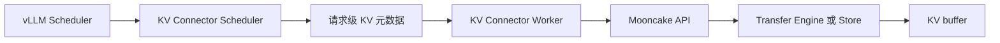

# 08: Mooncake 在 vLLM / vLLM Ascend 中如何落地

## 本期目标

前面几期已经分别介绍了 [`Transfer Engine`](glossary.md#transfer-engine)、[`P2P`](glossary.md#p2p) KV 传输、[`Mooncake Store`](glossary.md#mooncake-store) 和 [`Prefix Cache`](glossary.md#prefix-cache)。本期把这些机制映射回推理服务入口。

本期只回答一个问题：上层推理系统如何把自己的 [`KV cache`](glossary.md#kv-cache) buffer 交给 Mooncake？

## 背景问题

[`vLLM`](glossary.md#vllm) 是大模型推理服务引擎，负责请求调度、batching、模型执行和 KV cache 管理。batching 指把多个请求或 token 组织成 batch 一起执行。Mooncake 不应该直接侵入 vLLM 的所有调度逻辑，而是通过 [`connector`](glossary.md#connector) 接入。connector 是 vLLM 中用于通过外部系统移动或加载 KV cache 的抽象。

[`vLLM Ascend`](glossary.md#vllm-ascend) 是 vLLM 在 Ascend NPU 生态中的适配和扩展。Ascend 是昇腾 AI 计算硬件和软件生态，[`NPU`](glossary.md#npu) 是面向神经网络计算的专用加速设备。Ascend 场景下，Mooncake 仍然处理 KV cache，但底层 buffer、传输和设备内存约束会不同。

## 核心图解

这张图描述 connector 的分层。Scheduler 侧更关心请求何时需要加载或保存 KV；Worker 侧更接近实际 KV buffer 和模型执行设备。请求级元数据把调度决策传给 worker。Mooncake API 最终调用 Transfer Engine 或 Store，把 KV buffer 传输或存储起来。

## vLLM 中的接入点

vLLM 通过 `KVTransferConfig` 描述 KV transfer 配置。这里的 KV transfer 指外部 KV cache 传输或存储能力。配置中会出现 connector 名称、当前实例角色、端口和额外参数。实例角色常见有 producer、consumer 或 both，表示当前服务实例主要生产 KV、消费 KV，还是两者都做。

真正的 connector 由 factory 根据配置名创建。factory 是把字符串配置映射到具体实现类的工厂逻辑。这样 vLLM 核心不需要硬编码所有后端细节，Mooncake、LMCache 或其他 connector 可以通过同一类接口接入。

## vLLM Ascend 中的差异

vLLM Ascend 也使用 connector 思路，但硬件路径不同。Ascend 设备涉及 [`CANN`](glossary.md#cann)、[`HCCN`](glossary.md#hccn)、NPU 显存和 Ascend transport。CANN 是 Ascend 的异构计算软件栈，HCCN 和设备间通信有关，transport 指数据传输机制。

因此，vLLM Ascend 中会出现 `MooncakeConnector`、`MooncakeLayerwiseConnector`、`AscendStoreConnector` 和 Mooncake backend 等实现。它们仍然围绕 KV cache，但要处理 Ascend 场景下的内存注册、分层加载、设备同步和后端选择。

## 本阶段收束

到这里，机制主线已经完整：用户请求生成 KV cache，KV cache 可能被 P2P 传输给 decode 节点，也可能被 Mooncake Store 存入共享缓存池，后续请求通过 prefix cache 复用。vLLM 和 vLLM Ascend 提供调用入口，Mooncake 提供传输和存储能力。

后续 09-20 课会进入源码专题。源码专题的写法不是逐行走读，而是围绕调用链、数据结构和状态变化，看 Mooncake 如何把这些机制落到代码中。

## 代码入口

| 问题 | 代码入口 |
| --- | --- |
| vLLM KV transfer 配置 | `repos/vllm/vllm/config/kv_transfer.py` |
| vLLM connector factory | `repos/vllm/vllm/distributed/kv_transfer/kv_connector/factory.py` |
| vLLM Mooncake connector 路径 | `repos/vllm/vllm/distributed/kv_transfer/kv_connector/v1/mooncake/` |
| vLLM Ascend P2P connector | `repos/vllm-ascend/vllm_ascend/distributed/kv_transfer/kv_p2p/mooncake_connector.py` |
| vLLM Ascend Store connector | `repos/vllm-ascend/vllm_ascend/distributed/kv_transfer/kv_pool/ascend_store/` |

## 小结

本期只需要记住三点：

1. vLLM 通过 connector 把 KV cache 的外部传输和存储能力接入推理服务。
2. Mooncake 在 connector 之后提供 Transfer Engine 和 Store 两类核心能力。
3. vLLM Ascend 的主线相同，但底层 NPU 内存、CANN、HCCN 和 transport 会带来额外适配。

下一期开始源码专题，先建立 Transfer Engine 的代码地图。
