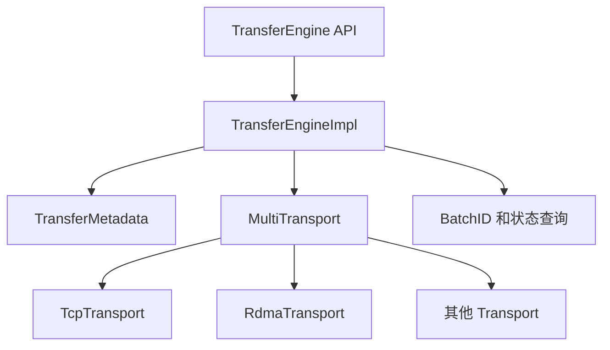

# 09: Transfer Engine 源码总览

## 本期目标

从本期开始进入源码专题。前面已经解释过 [`Transfer Engine`](glossary.md#transfer-engine)，也就是 Mooncake 中负责在内存、设备和机器之间高效移动数据的组件。本期不追具体传输细节，而是先建立源码地图。

本期只回答一个问题：读 Transfer Engine 源码时，应该先抓住哪些核心抽象？

## 背景问题

很多系统代码难读，是因为入口、数据结构和执行者混在一起。Transfer Engine 也是如此：它既有对外 API，也有元数据管理，还有 TCP、RDMA、NVLink、Ascend 等不同 [`transport`](glossary.md#transport) 后端。transport 指具体数据传输通道或传输机制。

如果一开始就进入某个 RDMA 函数，很容易迷失。更稳妥的路径是先分清四个抽象：`TransferEngine`、[`Segment`](glossary.md#segment)、[`BatchTransfer`](glossary.md#batchtransfer) 和 `Transport`。Segment 是 Transfer Engine 能识别的一组可访问地址范围，BatchTransfer 是一批读写传输任务。

## 核心图解

这张图是源码阅读地图。`TransferEngine API` 是上层调用入口；`TransferEngineImpl` 承接主要实现；`TransferMetadata` 负责 segment 和 buffer 等元数据；`MultiTransport` 管理多个 transport 后端；`BatchID` 是提交一批传输任务后的标识，用于状态查询和释放。

## TransferEngine：对外门面

`TransferEngine` 是调用者最先接触的类。它提供初始化、安装 transport、打开远端 segment、注册本地内存、提交传输和查询状态等方法。对上层来说，这个类隐藏了底层后端差异。

源码阅读时可以先看 `transfer_engine.h`。不要急着理解每个函数实现，而是先把 API 分成三组：资源准备、传输提交、状态管理。资源准备包括安装 transport、注册内存和打开 segment；传输提交包括 `submitTransfer`；状态管理包括 `getTransferStatus` 和 `freeBatchID`。

## MultiTransport：后端分发器

`MultiTransport` 负责管理多个具体 transport。它接收一批传输请求后，需要决定每条请求交给哪个后端处理。这个选择可能和协议名、地址位置、设备类型或显式 hint 有关。这里的 hint 是上层给出的传输偏好。

这样设计的好处是：Transfer Engine 的主接口不需要为每个硬件写一套 API。新增后端时，重点实现新的 transport，而不是改动所有上层调用。

## Metadata：让远端能找到数据

传输前必须有元数据。`TransferMetadata` 记录 segment、buffer、节点地址和传输所需描述信息。没有这些数据，远端即使知道一个地址数字，也无法判断它是否属于可传输内存。

这也是 Transfer Engine 和普通 memcpy 的根本差别：memcpy 只在本进程地址空间内工作，而 Mooncake 要跨进程、跨机器甚至跨设备移动数据。

## 代码入口

| 问题 | 代码入口 |
| --- | --- |
| Transfer Engine 对外类 | `repos/Mooncake/mooncake-transfer-engine/include/transfer_engine.h` |
| Transfer Engine 主要实现 | `repos/Mooncake/mooncake-transfer-engine/include/transfer_engine_impl.h` |
| 多 transport 管理 | `repos/Mooncake/mooncake-transfer-engine/include/multi_transport.h` |
| transport 基类和请求结构 | `repos/Mooncake/mooncake-transfer-engine/include/transport/transport.h` |
| segment 元数据结构 | `repos/Mooncake/mooncake-transfer-engine/include/transfer_metadata.h` |

## 小结

本期只需要记住三点：

1. Transfer Engine 源码先按 API、metadata、transport、状态管理四块理解。
2. `TransferEngine` 是门面，`MultiTransport` 是后端分发器。
3. 后续阅读要沿着一次传输请求追踪，而不是从某个硬件后端随机开始。

下一期深入 Segment 与内存注册：远端为什么能定位并访问本地注册过的内存。
