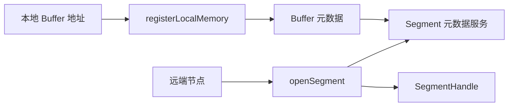

# 10: Segment 与内存注册机制

## 本期目标

上一期建立了 Transfer Engine 的源码地图。本期聚焦 [`Segment`](glossary.md#segment) 和内存注册。Segment 是 Transfer Engine 能识别的一组可访问地址范围，内存注册是把某段本地 buffer 纳入可传输范围的过程。这里的 buffer 指保存数据的一段内存区域。

本期只回答一个问题：远端节点为什么能定位并访问本地注册过的内存？

## 背景问题

在普通程序里，一个指针只对当前进程有意义。比如本地地址 `0x1234` 不能直接发给另一台机器让它读取，因为远端进程的 `0x1234` 可能指向完全不同的内容，甚至不可访问。

Mooncake 要移动 [`KV cache`](glossary.md#kv-cache)，也就是模型 attention 产生的 key/value tensor 缓存，就必须把“本地地址”转成“集群里可理解的位置”。这个转换依赖内存注册、segment 元数据和远端打开 segment。

## 核心图解

这张图描述地址可见性的建立过程。本地节点调用 `registerLocalMemory` 把 buffer 注册到 Transfer Engine；相关 buffer 信息进入 segment 元数据服务。远端节点调用 `openSegment` 查询这些信息，拿到 `SegmentHandle`，也就是后续传输请求引用远端 segment 的句柄。

## registerLocalMemory 做什么

`registerLocalMemory` 的输入通常包括本地地址、长度和 [`Memory Location`](glossary.md#memory-location)。Memory Location 是描述内存所在设备或 NUMA 位置的信息。NUMA 是多 CPU 系统中内存访问距离不完全相同的硬件结构。

注册时，Transfer Engine 需要记录这段地址范围，并让 transport 后端做必要准备。对于 RDMA，这可能涉及 memory region 和远端访问权限；对于设备内存，还可能涉及 GPU、NPU 或驱动运行时的注册逻辑。这里的 RDMA 是远程直接内存访问技术，可以减少 CPU 参与的数据拷贝。

## openSegment 为什么必要

`openSegment` 让远端把一个 segment 名字解析成可用于传输的句柄。这个动作通常会访问 metadata service，拿到远端节点暴露的 buffer 列表、地址范围、设备信息和连接信息。

源码中要注意：`openSegment` 不是把数据读回来，它只是建立“我知道如何引用这个远端地址空间”的前置状态。真正的数据移动发生在后续 [`BatchTransfer`](glossary.md#batchtransfer) 提交时。

## 元数据一致性

内存注册和注销会改变可访问地址范围。如果上层释放了 buffer，但元数据还认为它可用，远端就可能读到错误地址。因此 `unregisterLocalMemory` 和元数据更新同样重要。

这个机制解释了为什么 Mooncake 的错误排查经常会看到“segment 打不开”“buffer 未注册”“metadata 不一致”这类问题。它们不是网络小问题，而是传输地址空间没有正确建立。

## 代码入口

| 问题 | 代码入口 |
| --- | --- |
| 注册、注销、打开 segment 的对外接口 | `repos/Mooncake/mooncake-transfer-engine/include/transfer_engine.h` |
| 具体实现入口 | `repos/Mooncake/mooncake-transfer-engine/include/transfer_engine_impl.h` |
| Segment 元数据结构 | `repos/Mooncake/mooncake-transfer-engine/include/transfer_metadata.h` |
| 内存位置描述 | `repos/Mooncake/mooncake-transfer-engine/include/memory_location.h` |
| C 接口中的注册和 openSegment | `repos/Mooncake/mooncake-transfer-engine/include/transfer_engine_c.h` |

## 小结

本期只需要记住三点：

1. 本地指针不能直接跨机器使用，必须通过 segment 和元数据变成可传输位置。
2. `registerLocalMemory` 建立本地 buffer 的可传输范围，`openSegment` 让远端获得引用句柄。
3. 注册、注销和元数据一致性是 KV cache 传输正确性的前提。

下一期追一次 BatchTransfer：传输任务如何提交、拆分、执行和完成。
