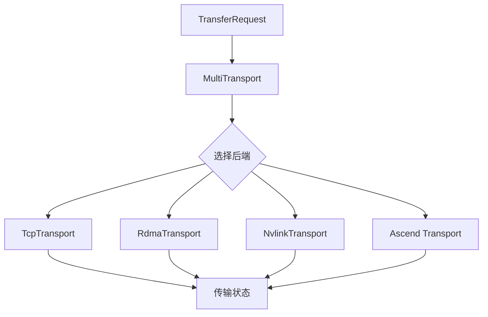

# 12: Transport 后端选择与 RDMA/TCP 路径

## 本期目标

上一期追踪了 [`BatchTransfer`](glossary.md#batchtransfer) 的生命周期。本期关注 [`Transport`](glossary.md#transport)：Transport 是具体的数据传输通道或传输机制，例如 [`TCP`](glossary.md#tcp)、[`RDMA`](glossary.md#rdma)、[`NVLink`](glossary.md#nvlink) 或 Ascend transport。TCP 是通用网络传输协议，RDMA 是远程直接内存访问技术，NVLink 是 NVIDIA GPU 之间的高速互联。

本期只回答一个问题：Mooncake 为什么要把统一传输接口和具体硬件传输后端分开？

## 背景问题

[`KV cache`](glossary.md#kv-cache) 可能在 CPU 内存、GPU 显存、NPU 显存或 [`SSD`](glossary.md#ssd) 相关路径之间移动。CPU 是通用处理器，GPU 和 NPU 是常见深度学习加速设备，SSD 是固态硬盘。不同位置对应不同传输能力：TCP 通用但 CPU 开销较高，RDMA 适合跨节点高带宽传输，NVLink 偏向同机 GPU 间高速传输，Ascend transport 面向 Ascend NPU 生态。

如果上层每遇到一种硬件就写一套传输调用，代码会很快失控。Mooncake 的做法是让上层提交统一的传输请求，再由 `MultiTransport` 和具体 transport 决定执行路径。

## 核心图解

这张图说明 transport 分层。`TransferRequest` 描述要移动的数据，`MultiTransport` 决定交给哪个后端。不同后端完成自己的连接、内存注册、任务切片和状态更新，但向上返回统一的传输状态。

## TCP 和 RDMA 的差异

[`TCP`](glossary.md#tcp) 是通用网络传输协议，部署门槛低，适合作为兼容路径。但对于大块 KV cache，TCP 往往需要更多 CPU 参与和内存拷贝。

[`RDMA`](glossary.md#rdma) 是远程直接内存访问技术，可以让网卡在较少 CPU 参与的情况下访问远端注册内存。它适合 Mooncake 这类大块数据传输场景，但对网卡、驱动、内存注册和网络配置要求更高。

因此，Mooncake 需要同时支持“容易跑通”的路径和“高性能生产”的路径。transport 分层让这两类路径共用上层 API。

## 设备侧传输

在 GPU 或 NPU 场景中，KV cache 可能已经在设备显存里。这里的显存指加速设备上的内存。如果每次都先拷到 CPU 内存，再通过网络发送，会引入额外开销。设备侧传输的目标是尽量减少无用拷贝。

Mooncake 中的 NVLink、IntraNode NVLink、Ascend 相关 transport，都服务于这种更具体的硬件路径。读源码时不需要一开始掌握所有后端，但要明白它们都实现相同抽象：注册可传输内存、提交传输任务、返回完成状态。

## 代码入口

| 问题 | 代码入口 |
| --- | --- |
| transport 抽象基类 | `repos/Mooncake/mooncake-transfer-engine/include/transport/transport.h` |
| 多后端选择入口 | `repos/Mooncake/mooncake-transfer-engine/include/multi_transport.h` |
| RDMA transport | `repos/Mooncake/mooncake-transfer-engine/include/transport/rdma_transport/rdma_transport.h` |
| TCP transport 源码目录 | `repos/Mooncake/mooncake-transfer-engine/src/transport/tcp_transport/` |
| Ascend transport 源码目录 | `repos/Mooncake/mooncake-transfer-engine/src/transport/ascend_transport/` |

## 小结

本期只需要记住三点：

1. Transport 分层让上层用统一接口提交传输请求。
2. TCP 更通用，RDMA 更适合高带宽低 CPU 开销的大块 KV cache 传输。
3. GPU、NPU 和 Ascend 等设备路径需要专门后端，但仍服从同一传输抽象。

下一期进入 Mooncake Store 源码地图，看分布式 KV cache 存储层如何组织。
