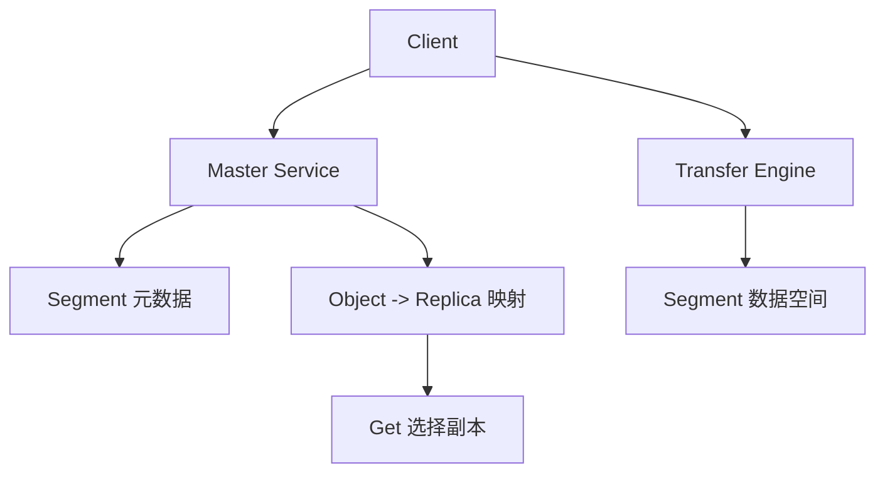

# 13: Mooncake Store 架构源码导读

## 本期目标

前面几期已经完成 Transfer Engine 源码主线。本期进入 [`Mooncake Store`](glossary.md#mooncake-store)：Mooncake Store 是 Mooncake 中作为分布式 [`KV cache`](glossary.md#kv-cache) 存储层的组件。

本期只回答一个问题：读 Mooncake Store 源码时，应该先理解哪些角色和边界？

## 背景问题

Store 代码比 Transfer Engine 更像一个分布式缓存系统。它不仅要移动数据，还要管理对象 key、空间分配、副本、租约、淘汰和持久化。这里的对象 key 是缓存对象名字，租约是防止对象使用中被提前回收的保护机制，持久化指把数据保存到更长期的存储介质。

如果直接从 `real_client.cpp` 某个函数读起，很容易被细节淹没。更好的入口是先把 Store 分成四个角色：Client、Master Service、Segment、Replica。Client 是发起 Put/Get 的客户端逻辑；Master Service 管理元数据和空间；[`Segment`](glossary.md#segment) 是可管理存储空间；[`Replica`](glossary.md#replica) 是对象的一份副本。

## 核心图解

这张图描述 Store 的控制流和数据流。Client 向 Master Service 查询或更新元数据；Master Service 管理 segment 和 replica 映射；真正的数据读写通过 Transfer Engine 进入 segment 数据空间。Get 请求会先查元数据，再选择可用副本读取。

## Client：上层看到的 Store

Store 的客户端接口提供 Put、Get、Remove、BatchPut、BatchGet、Query、register buffer 等能力。这里的 Query 指只查询对象元数据，不直接读出大块数据。register buffer 指把上层给出的目标 buffer 注册到传输系统中。

对 vLLM 这类上层系统来说，Client 是主要接触面。它不应该知道 Master Service 内部如何选择 segment，也不应该手动拼每一次底层传输。

## Master Service：元数据和空间管理

Master Service 维护对象和副本的关系，也知道有哪些 segment 可以分配空间。Put 时它要给对象找到合适位置；Get 时它要返回可读取的 replica；空间不足时它要配合淘汰策略释放位置。

Master Service 不应该搬运大块 KV cache。它更像控制面，负责告诉系统“数据应该放哪里、现在在哪里、是否还有效”。

## Replica：读取正确性的核心

Replica 记录对象副本的位置、大小、状态和所属 segment。一个对象可能有多个 replica。Get 时，客户端会根据 replica 状态、位置和本地性选择读取来源。

读 Store 源码时要特别关注 replica 状态。未完成写入的副本不能被当成完整对象读取；被淘汰或失效的副本也不能继续命中。

## 代码入口

| 问题 | 代码入口 |
| --- | --- |
| Store 设计文档 | `repos/Mooncake/docs/source/design/mooncake-store.md` |
| Client 抽象接口 | `repos/Mooncake/mooncake-store/include/pyclient.h` |
| RealClient 实现 | `repos/Mooncake/mooncake-store/include/real_client.h` |
| Master Service | `repos/Mooncake/mooncake-store/include/master_service.h` |
| Replica 数据结构 | `repos/Mooncake/mooncake-store/include/replica.h` |

## 小结

本期只需要记住三点：

1. Mooncake Store 源码先按 Client、Master Service、Segment、Replica 四个角色理解。
2. Master Service 管元数据和空间，Transfer Engine 搬大块数据。
3. Replica 状态决定对象是否能被安全读取。

下一期追 Put 路径：KV cache 如何写入 Store。
