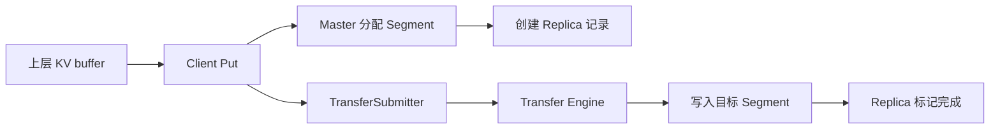

# 14: Put 路径：KV cache 如何写入 Store

## 本期目标

上一期建立了 [`Mooncake Store`](glossary.md#mooncake-store) 的源码地图。本期追一次 Put 路径。Put 是把对象写入 Store 的操作，BatchPut 是一次写入多个对象的批量版本。

本期只回答一个问题：一份 [`KV cache`](glossary.md#kv-cache) 如何从上层 buffer 写入 Store 并变成可查询对象？

## 背景问题

KV cache 要被后续请求复用，必须先被保存。保存不是简单把字节写到某个 map 里，因为对象可能很大，可能来自设备显存，也可能需要多个副本。这里的显存指 GPU 或 NPU 等加速设备上的内存。

Put 路径需要同时处理控制流和数据流。控制流负责检查 key、分配 segment、创建 replica 元数据；数据流负责把 buffer 中的 KV cache 搬到目标位置。这里的 [`Segment`](glossary.md#segment) 是可管理的连续存储空间，[`Replica`](glossary.md#replica) 是对象的一份副本。

## 核心图解

这张图描述 Put 的主路径。Client 接收上层 buffer 和 key；Master Service 分配空间并创建 replica 记录；`TransferSubmitter` 是 Store 中封装传输提交的组件；Transfer Engine 执行数据移动；写入完成后 replica 才能被标记为完整。

## 对象切分和空间申请

大型 KV cache 对象可能被拆成多个 slice。这里的 [`Slice`](glossary.md#slice) 是对象内一段连续数据范围。切分后，Store 可以把对象放入一个或多个 segment，也可以为多个副本分配不同位置。

空间申请由 Master Service 控制。它要知道每个 segment 的剩余空间、分配策略和租户限制。租户限制指不同业务或用户可使用缓存容量的边界。Put 不是随便找块内存写入，而是要经过统一空间管理。

## 数据写入和状态更新

当目标位置确定后，客户端通过 Transfer Engine 把数据写入目标 segment。写入过程中 replica 不能提前被当成可读对象，否则 Get 可能读到不完整数据。

因此 Put 路径的关键状态变化是：先创建占位或写入中的 replica，完成数据传输后，再把 replica 标记为完成。这个状态顺序是 Store 正确性的基础。

## BatchPut 为什么重要

推理系统可能按 KV block 保存对象，一次请求会产生多个缓存对象。如果逐个 Put，会有大量元数据请求和传输提交开销。BatchPut 可以把多个对象的控制流和数据流合并处理，提高吞吐。

这里的 [`throughput`](glossary.md#throughput) 是单位时间处理能力。源码阅读时，要把单对象 Put 和 BatchPut 对照看，理解批处理在哪些地方减少重复工作。

## 代码入口

| 问题 | 代码入口 |
| --- | --- |
| Client Put/BatchPut 接口 | `repos/Mooncake/mooncake-store/include/pyclient.h` |
| RealClient Put 相关实现 | `repos/Mooncake/mooncake-store/src/real_client.cpp` |
| Master Service 对象和 segment 管理 | `repos/Mooncake/mooncake-store/include/master_service.h` |
| TransferSubmitter 传输封装 | `repos/Mooncake/mooncake-store/include/transfer_task.h` |
| Replica 状态结构 | `repos/Mooncake/mooncake-store/include/replica.h` |

## 小结

本期只需要记住三点：

1. Put 路径同时包含元数据分配和大块数据传输。
2. Replica 必须在数据写入完成后才变成可读状态。
3. BatchPut 面向多对象 KV cache 写入，减少重复控制流和传输开销。

下一期追 Get 路径：KV cache 如何被读取并交还给上层。
