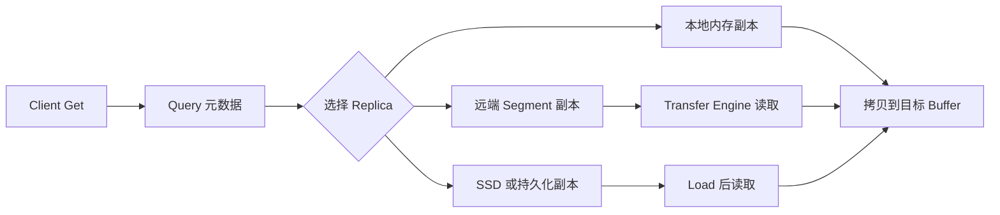

# 15: Get 路径：KV cache 如何被读取和复用

## 本期目标

上一期追了 Put 路径。本期追 Get 路径。Get 是从 [`Mooncake Store`](glossary.md#mooncake-store) 读取对象的操作，BatchGet 是批量读取多个对象的版本。

本期只回答一个问题：一个后续请求命中缓存后，Store 如何把 [`KV cache`](glossary.md#kv-cache) 读回上层 buffer？

## 背景问题

[`Prefix Cache`](glossary.md#prefix-cache) 命中只说明“可能存在可复用 KV cache”。真正恢复请求状态，还需要把 Store 中的对象读回推理引擎可用的 buffer。这里的 buffer 是保存数据的一段内存区域，可能位于 CPU 内存、GPU 显存或 NPU 显存。

Get 路径同样分为控制流和数据流。控制流先 Query 对象元数据，确认是否有完整 [`Replica`](glossary.md#replica)。数据流再通过本地拷贝或 [`Transfer Engine`](glossary.md#transfer-engine) 把数据读入目标 buffer。Replica 是对象的一份副本。

## 核心图解

这张图描述 Get 的选择过程。Client 先查询元数据，再根据 replica 位置和状态选择读取路径。本地副本可以直接拷贝，远端 segment 需要 Transfer Engine，SSD 或持久化副本可能需要先 load 到可读位置。

## Query 和 Get 的区别

Query 只获取对象元数据，例如副本列表、状态、大小和租约信息。Get 则要真正把对象内容读出来。把两者分开有利于批处理：系统可以先批量 Query，再根据所有结果选择更合适的读取策略。

这里的租约是 [`Lease`](glossary.md#lease)，也就是防止对象在读取期间被淘汰或修改状态的保护机制。如果读取过程中对象被回收，Get 就可能拿到不完整数据。因此 Get 路径需要和 lease、replica 状态配合。

## 选择 Replica

Store 通常优先选择本地、完整、代价低的 replica。本地内存副本最快；远端内存副本需要网络传输；SSD 或分布式文件系统副本延迟更高，但容量更大。

选择 replica 时不能只看距离，还要看状态。只有完整状态的 replica 才能作为正确数据源。如果一个 replica 正在写入、已经失效或处于故障状态，Get 必须跳过它。

## BatchGet 和缓存恢复

上层推理系统恢复一段 prefix 的 KV cache 时，可能需要读取多个对象或多个 block。BatchGet 可以减少 Query 和传输提交的开销。对于 prefix cache，BatchGet 是否高效会直接影响缓存命中后的实际收益。

如果命中检查很快，但读取 KV cache 很慢，用户仍然会感受到高延迟。因此 Get 路径是 prefix cache 从“理论可复用”走向“实际加速”的关键。

## 代码入口

| 问题 | 代码入口 |
| --- | --- |
| Client Get/BatchGet/Query 接口 | `repos/Mooncake/mooncake-store/include/pyclient.h` |
| RealClient Get 和 BatchGet 实现 | `repos/Mooncake/mooncake-store/src/real_client.cpp` |
| Replica 选择相关结构 | `repos/Mooncake/mooncake-store/include/replica.h` |
| TransferSubmitter 读取封装 | `repos/Mooncake/mooncake-store/include/transfer_task.h` |
| 存储后端 load/offload 接口 | `repos/Mooncake/mooncake-store/include/storage_backend.h` |

## 小结

本期只需要记住三点：

1. Get 路径先 Query 元数据，再选择可用 replica 读取数据。
2. 只有完整且有效的 replica 才能作为 KV cache 恢复来源。
3. BatchGet 决定 prefix cache 命中后能否真正降低延迟。

下一期看缓存空间管理：分配、淘汰、Lease 和 Pin 如何保证容量与正确性。
