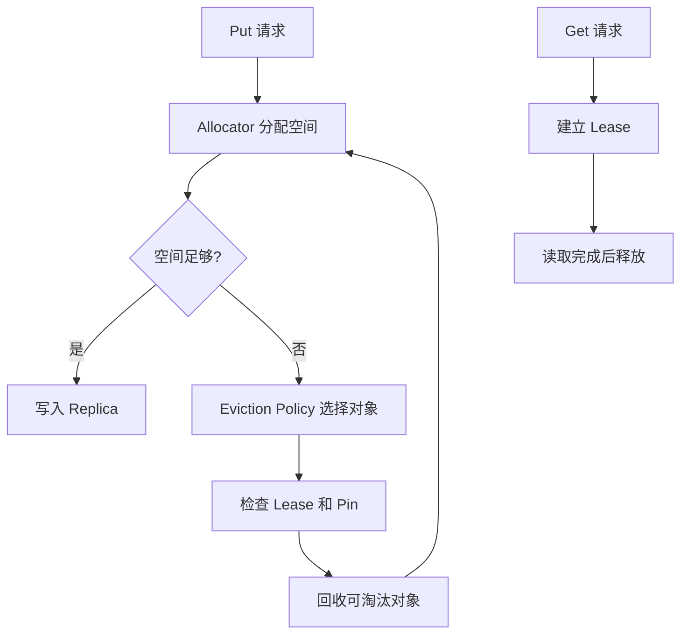

# 16: 缓存空间管理：分配、淘汰、Lease、Pin

## 本期目标

前两期分别追了 Put 和 Get 路径。本期关注 [`Mooncake Store`](glossary.md#mooncake-store) 的缓存空间管理：对象写入时如何分配空间，空间不够时如何淘汰，读取中如何避免对象被提前回收。

本期只回答一个问题：Mooncake Store 如何在有限空间里安全管理大量 [`KV cache`](glossary.md#kv-cache) 对象？

## 背景问题

KV cache 会随着上下文长度、并发请求数和模型层数增长。即使有外部 Store，缓存空间也不是无限的。系统必须决定哪些对象保留，哪些对象淘汰，哪些对象暂时不能动。

这里有几个关键术语。[`Allocator`](glossary.md#allocator) 是负责分配和释放缓存空间的组件；[`Eviction Policy`](glossary.md#eviction-policy) 是决定淘汰哪些对象的策略；[`Lease`](glossary.md#lease) 是读取或写入期间保护对象不被提前回收的租约；[`Pin`](glossary.md#pin) 是提高对象保留优先级的保护标记。

## 核心图解

这张图描述空间管理的主循环。Put 需要 allocator 分配空间；空间不足时，淘汰策略选择候选对象；Lease 和 Pin 会阻止正在使用或重要对象被回收；Get 读取期间建立 Lease，读取完成后释放保护。

## Allocator：管理碎片和容量

Allocator 面对的是 segment 内部空间。[`Segment`](glossary.md#segment) 是可管理的连续存储空间，但对象大小不同，频繁写入和删除会产生碎片。碎片指总空闲空间足够、但连续空间不足以放下新对象的情况。

Mooncake Store 中的 allocator 需要在分配速度、内存利用率和碎片控制之间平衡。对于 KV cache 这类大对象，空间管理效率会直接影响缓存容量和命中率。

## Eviction Policy：决定谁离开

Eviction Policy 负责在空间不足时选择可淘汰对象。常见考虑包括最近是否访问、对象大小、是否有副本、是否被 pin、是否有活跃 lease。

淘汰不能破坏正确性。正在被 Get 读取的对象不能突然消失；未完成写入的对象不能被错误暴露；被 hard pin 的对象不能被淘汰。这里的 hard pin 指强保护标记，soft pin 指较弱保护标记，在极端空间压力下仍可能被淘汰。

## Lease 和 Pin 的差异

Lease 是临时保护，通常和一次读写操作绑定。Get 开始时建立 lease，读取结束后释放。它解决的是“对象正在被用，别回收”。

Pin 更像策略保护。soft pin 适合重要但不是绝对不可丢的对象，例如常用系统提示词；hard pin 适合必须保留的对象，例如关键元数据。Pin 解决的是“这个对象比普通对象更应该保留”。

## 代码入口

| 问题 | 代码入口 |
| --- | --- |
| allocator 抽象 | `repos/Mooncake/mooncake-store/include/allocator.h` |
| 分配策略 | `repos/Mooncake/mooncake-store/include/allocation_strategy.h` |
| 淘汰策略 | `repos/Mooncake/mooncake-store/include/eviction_strategy.h` |
| Master Service 空间和对象管理 | `repos/Mooncake/mooncake-store/include/master_service.h` |
| Store 设计文档中的 Lease 和 Pin | `repos/Mooncake/docs/source/design/mooncake-store.md` |

## 小结

本期只需要记住三点：

1. Store 的缓存空间管理同时关注容量、碎片和对象正确性。
2. Eviction Policy 选择淘汰候选，但 Lease 和 Pin 会限制哪些对象能被回收。
3. Lease 是操作期间的临时保护，Pin 是对象级保留策略。

下一期进入多层存储：Mooncake Store 如何把对象下沉到 SSD 或分布式文件系统。
