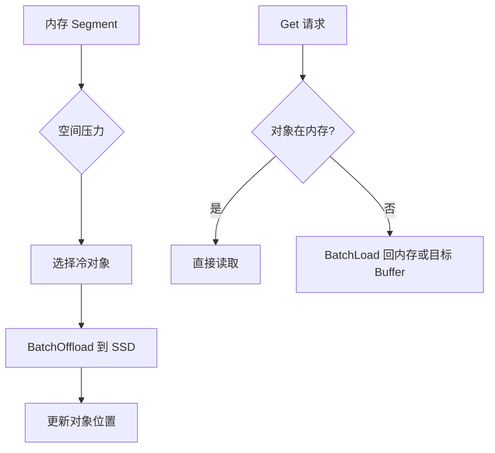

# 17: 多层存储与 SSD Offload

## 本期目标

上一期讲了内存缓存空间如何分配和淘汰。本期进入多层存储。多层存储指把热数据留在高速内存，把冷数据下沉到更大但更慢的介质，例如 [`SSD`](glossary.md#ssd) 或分布式文件系统。SSD 是固态硬盘；[`Offload`](glossary.md#offload) 指把内存中的缓存对象卸载到低速大容量存储层。

本期只回答一个问题：[`Mooncake Store`](glossary.md#mooncake-store) 如何在容量和性能之间做分层？

## 背景问题

[`KV cache`](glossary.md#kv-cache) 容量需求很大，而 GPU 或 NPU 显存、主机内存都有限。只靠内存缓存，命中率可能很快下降。把一部分对象下沉到 SSD，可以扩大有效缓存容量，但读取延迟会增加。

这里的热数据是近期频繁访问、应留在高速层的数据；冷数据是暂时不常访问、可以放到低速大容量层的数据。多层存储的目标不是让 SSD 变得和内存一样快，而是在成本、容量和延迟之间找到可接受平衡。

## 核心图解

这张图描述 offload 和 [`Load`](glossary.md#load)。Load 指需要读取时把对象从低速存储层加载回可访问位置。`BatchOffload` 是批量把对象从内存下沉到存储后端的操作；`BatchLoad` 是需要读取时把对象加载回来。对象位置更新后，Get 才能知道应该从高速层还是低速层取数据。

## Offload 不等于删除

淘汰通常意味着释放缓存对象；offload 则是把对象内容迁移到更低层存储，保留后续读取可能性。对象从内存移动到 SSD 后，内存空间被释放，但对象元数据仍然需要记录它的新位置。

这使得 Store 能在内存压力下保留更多可复用 KV cache。但代价是：后续命中这些对象时，需要 load，延迟比内存命中高。

## Load 路径的关键

当 Get 发现对象不在内存层，而是在 SSD 或分布式文件系统中，它需要触发 load。Load 可能把数据读回内存 segment，也可能直接读到上层提供的目标 buffer，具体取决于实现路径和后端能力。

这里的 [`Storage Backend`](glossary.md#storage-backend) 是负责把对象保存到 SSD、文件系统或其他持久化介质的组件。它不替代 Transfer Engine，而是和 Store 的元数据、空间管理共同工作。

## 性能权衡

多层存储提升容量，但会引入额外 I/O 和调度复杂度。适合被 offload 的通常是较冷、较大、短期内不一定再次访问的对象。如果把热点 prefix 的 KV cache 频繁下沉再加载，反而会增加延迟。

因此，offload 策略要和 eviction policy、pin、访问统计配合。重要对象可以被 soft pin 留在内存中，冷对象则优先下沉。

## 代码入口

| 问题 | 代码入口 |
| --- | --- |
| 存储后端抽象 | `repos/Mooncake/mooncake-store/include/storage_backend.h` |
| Store 多层存储设计 | `repos/Mooncake/docs/source/design/mooncake-store.md` |
| SSD offload 设计文档 | `repos/Mooncake/docs/source/design/ssd-offload.md` |
| RealClient 中 load/offload 相关路径 | `repos/Mooncake/mooncake-store/src/real_client.cpp` |
| 存储后端实现 | `repos/Mooncake/mooncake-store/src/storage_backend.cpp` |

## 小结

本期只需要记住三点：

1. SSD Offload 是把对象下沉到低速大容量层，不等于直接删除对象。
2. BatchOffload 释放内存空间，BatchLoad 让后续 Get 能重新读取对象。
3. 多层存储提升容量，但是否加速取决于冷热判断和访问模式。

下一期看 P2P Store，它和 Mooncake Store 不同，更偏无中心 master 的点对点对象共享。
