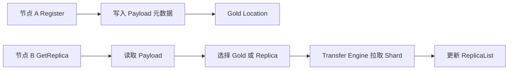

# 18: P2P Store 源码专题

## 本期目标

前面 Store 主线讲的是有 Master Service 的分布式缓存。本期看 [`P2P Store`](glossary.md#p2p-store)。P2P Store 是 Mooncake 中基于点对点方式共享对象的组件，典型特点是没有集中式 Master Service，而是通过元数据服务记录对象位置。

本期只回答一个问题：P2P Store 如何通过 Register 和 GetReplica 实现对象共享？

## 背景问题

[`P2P`](glossary.md#p2p) 是 point-to-point，指两个节点、进程或设备之间直接移动数据。P2P Store 面向的是“某个节点已有对象，其他节点想拉取副本”的场景。它和 Mooncake Store 的不同点在于：P2P Store 更像对象分发，Mooncake Store 更像分布式缓存池。

在源码里，P2P Store 的核心对象是 payload、shard 和 replica list。Payload 是被共享对象的整体元数据；[`Shard`](glossary.md#shard) 是对象被切分后的片段；replica list 是已经拥有某个 shard 副本的位置列表。

## 核心图解

这张图描述 P2P Store 的核心流程。Register 不一定传输数据，它把本地已有对象登记为 gold location，也就是原始可用位置。GetReplica 读取元数据后，从 gold 或已有 replica 拉取 shard。拉取成功后，新节点也会更新 replica list，成为后续节点的数据源。

## Register：登记已有数据

`Register` 接收对象名、地址列表、大小列表和最大 shard 大小。它会先把本地内存注册到 Transfer Engine，再把 payload 元数据写入 metadata service。这里的 metadata service 是保存集群元数据的服务，例如 etcd。

Register 的重点是“我这里有这份数据，你们以后可以从我这里拉”。它不是一次 Put 到中心缓存池，也不一定发生实际数据移动。

## GetReplica：拉取并成为副本

`GetReplica` 先从元数据服务读取 payload，找到每个 shard 可用的位置。然后它为本地目标地址注册内存，调用 Transfer Engine 从远端读取数据。读取成功后，它把自己的位置加入 replica list。

这个设计带来一个扩散效果：越多节点成功 GetReplica，后续节点可选择的数据源越多，单个原始节点的带宽压力越小。

## 元数据并发

多个节点可能同时更新同一个 payload。源码中通过 revision 做条件更新，避免覆盖别人刚写入的 replica list。这里的 revision 是元数据服务中记录版本的字段。

读 P2P Store 时要注意这个循环：读取 payload、传输数据、重新检查版本、更新 replica list。它保证数据源列表在并发拉取时不会轻易丢失更新。

## 代码入口

| 问题 | 代码入口 |
| --- | --- |
| P2P Store 设计文档 | `repos/Mooncake/docs/source/design/p2p-store.md` |
| Register 和 GetReplica 主路径 | `repos/Mooncake/mooncake-p2p-store/src/p2pstore/core.go` |
| Payload、Shard、metadata 结构 | `repos/Mooncake/mooncake-p2p-store/src/p2pstore/metadata.go` |
| 内存注册封装 | `repos/Mooncake/mooncake-p2p-store/src/p2pstore/registered_memory.go` |
| Go 侧 Transfer Engine 封装 | `repos/Mooncake/mooncake-p2p-store/src/p2pstore/transfer_engine.go` |

## 小结

本期只需要记住三点：

1. P2P Store 通过 Register 登记数据源，通过 GetReplica 拉取并扩散副本。
2. Payload、Shard 和 ReplicaList 是理解对象分发的三个核心结构。
3. 它更偏点对点对象共享，不等同于 Mooncake Store 的中心化元数据缓存池。

下一期看 Python / vLLM 集成入口，理解上层推理系统如何调用 Mooncake。
