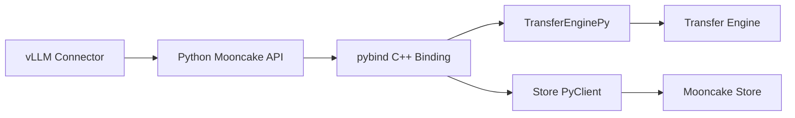

# 19: Python / vLLM 集成入口

## 本期目标

前面源码专题主要看 Mooncake 自身。本期看集成入口。Python binding 是把 C++ Mooncake 能力暴露给 Python 的绑定层，vLLM connector 则是 vLLM 调用外部 KV cache 能力的接入层。

本期只回答一个问题：上层推理系统传进来的 KV buffer 最终如何落到 Mooncake API？

## 背景问题

[`vLLM`](glossary.md#vllm) 的大部分推理服务逻辑在 Python 侧组织，而 Mooncake 的高性能传输和 Store 核心大量在 C++ 侧实现。Python binding 连接这两层：上层 Python 代码调用 `mooncake.engine` 或 `mooncake.store`，实际进入 C++ 实现。

这里的 [`KV cache`](glossary.md#kv-cache) buffer 是保存模型 key/value tensor 的内存区域。上层系统通常不会把它复制成普通 Python bytes，而是传递地址、大小、设备信息和请求元数据，让 Mooncake 在底层处理传输或存储。

## 核心图解

这张图描述集成层级。vLLM connector 在 Python 侧决定何时 load 或 save KV cache；Python Mooncake API 进入 pybind C++ binding；`TransferEnginePy` 封装 Transfer Engine；Store PyClient 封装 Mooncake Store 客户端。

## TransferEnginePy 的作用

`TransferEnginePy` 是 Transfer Engine 的 Python 可调用包装。它提供初始化、内存分配、同步读写、异步批量传输、注册内存和查询状态等方法。这里的同步表示调用等待传输完成，异步表示先提交任务再查询状态。

读这个文件时，重点不是记住每个绑定函数，而是看 Python 方法如何转换成 C++ Transfer Engine 调用。例如 `transfer_sync_read` 最终会构造传输请求并调用底层引擎。

## Store Python 入口

Store 侧的 Python binding 让上层可以创建 Mooncake Store 客户端、注册 buffer、Put、Get、BatchPut、BatchGet 和 Query。这里的 Query 是只查询对象元数据，不直接读取大块数据。

vLLM 的 Store connector 会把 KV block 或 prefix cache 对象转换成 Store key，再调用这些 API 保存或加载。Mooncake 不理解 prompt 语义，它处理的是 key、buffer、大小和对象元数据。

## vLLM Connector 的位置

[`connector`](glossary.md#connector) 是 vLLM 中用于通过外部系统移动或加载 KV cache 的抽象。Scheduler 侧决定哪些请求需要外部 KV，Worker 侧接触实际 KV buffer 并调用 Mooncake。

[`vLLM Ascend`](glossary.md#vllm-ascend) 中也有类似接入，但要处理 Ascend NPU 设备内存、CANN 和 HCCN 等约束。CANN 是 Ascend 异构计算软件栈，HCCN 和设备间通信有关。

## 代码入口

| 问题 | 代码入口 |
| --- | --- |
| Transfer Engine Python binding | `repos/Mooncake/mooncake-integration/transfer_engine/transfer_engine_py.cpp` |
| Store Python binding | `repos/Mooncake/mooncake-integration/store/store_py.cpp` |
| Store Python buffer pool | `repos/Mooncake/mooncake-integration/store/buffer_pool.cpp` |
| vLLM Mooncake connector | `repos/vllm/vllm/distributed/kv_transfer/kv_connector/v1/mooncake/` |
| vLLM Ascend Mooncake backend | `repos/vllm-ascend/vllm_ascend/distributed/kv_transfer/kv_pool/ascend_store/backend/mooncake_backend.py` |

## 小结

本期只需要记住三点：

1. Python binding 把 Python 侧 connector 调用接到 C++ Mooncake 实现。
2. 上层传入的核心不是文本，而是 KV buffer、大小、key 和请求元数据。
3. vLLM connector 决定何时调用 Mooncake，Mooncake 负责真正传输或存储。

下一期收束源码专题，整理故障与可观测性阅读地图。
