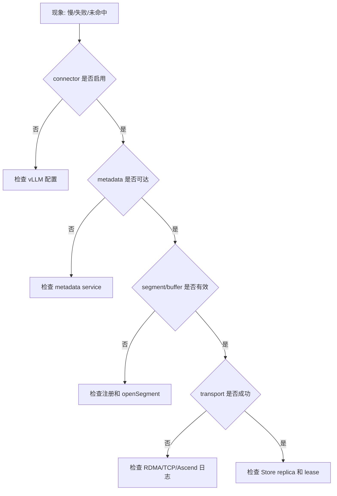

# 20: 故障与可观测性源码地图

## 本期目标

本期是 20 课主线的收束。前面已经讲过 Transfer Engine、Mooncake Store、P2P Store 和集成入口。本期把它们整理成排障地图。排障地图指遇到问题时，按现象、日志、错误码和源码入口逐步定位原因的方法。

本期只回答一个问题：当 Mooncake 相关 KV cache 传输或复用失败时，应该从哪里开始查？

## 背景问题

Mooncake 处在推理服务、网络、设备内存和存储系统之间。一个失败可能来自多层：vLLM connector 没启用，metadata service 不通，segment 没打开，buffer 没注册，transport 失败，replica 不完整，或者 Store 空间不足。这里的 metadata service 指保存集群元数据的服务，segment 是可传输或可管理的地址范围，buffer 是保存数据的一段内存区域，replica 是对象副本。

因此，不能只看“请求变慢”或“缓存没命中”。需要把问题归类到控制流、数据流、存储状态或上层集成。控制流是配置、调度和元数据；数据流是真正的数据传输；存储状态是对象、replica、lease 和淘汰；上层集成是 vLLM 或 vLLM Ascend 如何调用 Mooncake。

## 核心图解

这张图给出第一轮排查顺序。先确认 connector 配置，再确认 metadata service，再查 segment 和 buffer，之后进入 transport 和 Store 状态。这个顺序能避免一开始就陷入某个底层后端。

## 配置和 connector

如果 vLLM 没有启用 KV transfer，Mooncake 相关代码不会被调用。这里的 KV transfer 指外部 KV cache 传输或存储能力。首先检查 `KVTransferConfig`、connector 名称、`kv_role`、端口和 extra config。这里的 `kv_role` 是当前实例在 KV transfer 拓扑里的业务角色，例如 producer 或 consumer。

vLLM Ascend 还要确认 connector 名称是否映射到 AscendStoreConnector、MooncakeConnector 或 Mooncake backend。配置错误通常表现为没有 load/store 行为，或者请求带了 KV transfer 参数但没有 connector 接收。

## Metadata、Segment 和 Buffer

metadata service 不通会导致 segment 信息、对象信息或 P2P payload 无法获取。这里的 payload 指 P2P Store 中描述共享对象及其分片位置的元数据。

segment 打不开通常说明远端没有注册、名字不一致、服务不可达或元数据过期。buffer 未注册通常说明上层传入的地址没有进入 Transfer Engine 可传输范围。遇到这类问题，要回到 `registerLocalMemory`、`openSegment` 和 Store 的 `register_buffer`。

## Transport 和 Store 状态

transport 失败需要区分协议路径。TCP 问题多和地址、端口、连接有关；RDMA 问题还涉及网卡、驱动、内存注册和权限；Ascend transport 还涉及 CANN、HCCN 和设备同步。

Store 命中失败则要看对象是否存在、replica 是否完整、lease 是否过期、对象是否被淘汰或 offload。这里的 offload 指把对象从内存下沉到 SSD 或其他存储层。

## 代码入口

| 问题 | 代码入口 |
| --- | --- |
| Mooncake troubleshooting 文档 | `repos/Mooncake/docs/source/troubleshooting/troubleshooting.md` |
| Transfer Engine 错误码和状态 | `repos/Mooncake/mooncake-transfer-engine/include/common/base/status.h` |
| Store 错误码 | `repos/Mooncake/mooncake-store/include/types.h` |
| vLLM KV transfer 配置 | `repos/vllm/vllm/config/kv_transfer.py` |
| vLLM Ascend Mooncake connector | `repos/vllm-ascend/vllm_ascend/distributed/kv_transfer/` |

## 小结

本期只需要记住三点：

1. Mooncake 排障先分层：connector、metadata、segment/buffer、transport、Store 状态。
2. 传输失败和缓存未命中不是同一个问题，要分别沿数据流和元数据流查。
3. 20 课主线的最终目标，是让你能把一个现象映射到 Mooncake 的具体源码入口。

到这里，第一版 Mooncake 教程主线完成。后续如果继续扩展，可以围绕某个具体 bug、性能指标或 PR 做更细的源码走读。
