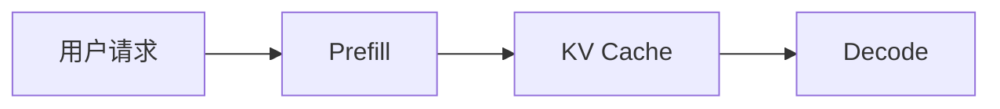

# 教程写作规范

## 目标读者

计算机科学本科生。默认读者理解基本操作系统、网络、Python、深度学习概念，但不熟悉大模型推理服务（LLM serving）、KV cache、vLLM 或 Mooncake。

## 风格

- 中文为主，必要英文术语保留原文。
- 先解释“为什么有这个问题”，再解释“系统怎么解决”。
- 不把源码细节作为入口。
- 遇到代码，只说明“这段代码在系统中负责什么”。
- 每期正文约 1500 字，不含图表和代码路径表。
- 控制解释密度：保留关键背景，删除重复展开。
- 不设置“思考题”部分；如需检查理解，只在正文中加入短小检查点。

## 图表要求

优先使用 Mermaid：

每张图后必须有 3-5 行解释，说明图中组件的职责和箭头含义。

## 每期必须回答

- 这一期解决哪个问题？
- 读者应该记住哪 3 个概念？
- 哪些代码以后需要查？
- 哪些问题留到下一期？
