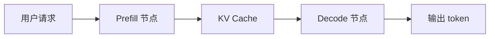
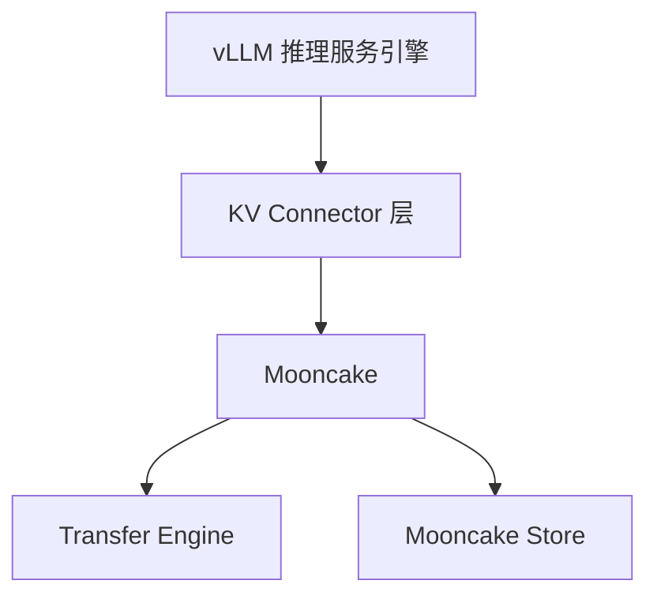

# 02: 从上下文缓存到分布式传输：理解大模型推理服务的数据通路

## 本期目标

上一期介绍了从 [`prompt`](glossary.md#prompt) 到回答的基本推理流程。prompt 是用户输入给模型的文本指令或上下文。本期在这个基础上建立全局图景：[`KV cache`](glossary.md#kv-cache) 是什么，[`vLLM`](glossary.md#vllm) 和 [`vLLM Ascend`](glossary.md#vllm-ascend) 分别解决什么问题，以及为什么在这些系统之外还要引入 [`Mooncake`](glossary.md#mooncake)。KV cache 是模型读完上下文后留下的 key/value 中间缓存；vLLM 是大模型推理服务引擎；vLLM Ascend 是 vLLM 在 Ascend NPU 生态中的适配；Mooncake 是面向推理系统的数据传输和缓存组件。

## KV Cache 是什么

[`Transformer`](glossary.md#transformer) 模型在生成文本时，会反复用到前文 [`token`](glossary.md#token) 的注意力信息。Transformer 是大模型常用的主干结构，token 是模型的基本输入和输出单位。为了避免每生成一个新 token 都重新计算全部历史上下文，系统会把每层 [`attention`](glossary.md#attention) 中的 key/value [`tensor`](glossary.md#tensor) 缓存下来，这就是 [`KV cache`](glossary.md#kv-cache)。attention 是让当前位置关注上下文中相关位置的机制，tensor 是深度学习中保存数据的多维数组。

大模型推理通常分为两个阶段：

- [`prefill`](glossary.md#prefill)：处理用户输入的 prompt，并生成初始 KV cache。
- [`decode`](glossary.md#decode)：逐 token 生成输出，并持续复用已有 KV cache。

可以把 KV cache 理解为“模型已经读过上下文后留下的中间记忆”。它不是最终输出，但 decode 阶段离不开它。

KV cache 的重要特点是：它和模型层数、序列长度、[`batch size`](glossary.md#batch-size)、并发请求数都相关。batch size 表示一次合并执行的规模，可以是请求数或 token 数。上下文越长、并发越高，需要保存的 KV cache 就越多。因此在推理系统里，KV cache 往往不是一个小优化，而是影响 [`显存`](glossary.md#显存) 占用、[`throughput`](glossary.md#throughput) 和 [`latency`](glossary.md#latency) 的核心资源。throughput 是单位时间处理能力，latency 是单个请求等待结果的时间。

## 基本生成流程



这张图描述了最基本的数据流。用户请求先进入 prefill 阶段，模型处理 prompt 后生成 KV cache；随后 decode 阶段使用这些 KV cache 逐步生成 token。图里的 Prefill 节点指负责 prefill 的进程或设备，Decode 节点指负责 decode 的进程或设备。单机情况下，KV cache 留在本地即可。但在高性能推理服务系统中，prefill 和 decode 往往会被拆到不同进程、设备或节点上。

为什么要拆开？因为 prefill 和 decode 的计算特征不同。prefill 面对的是一段 prompt，通常计算量大、适合 [`batching`](glossary.md#batching)，也就是批处理；decode 每次只生成少量 token，但要低 [`latency`](glossary.md#latency) 持续运行。拆开后可以分别优化资源使用，但代价是：decode 节点必须拿到 prefill 节点产生的 KV cache。

## vLLM 是什么

[`vLLM`](glossary.md#vllm) 是一个面向大模型推理服务的引擎，英文文档中常称为 [`LLM serving engine`](glossary.md#llm-serving-engine)，也就是大模型推理服务引擎。它的重点不是训练模型，而是让模型在线服务更高效。它负责请求调度、[`batching`](glossary.md#batching)、KV cache 管理、模型执行，以及对外提供 [`OpenAI-compatible API`](glossary.md#openai-compatible-api) 等能力。batching 指把多个请求或 token 合成 batch 一起执行，OpenAI-compatible API 指兼容 OpenAI 请求格式的服务接口。

对我们这个系列来说，vLLM 最关键的一点是：它不仅运行模型，也管理 KV cache。随着请求变多、上下文变长，KV cache 会成为 [`显存`](glossary.md#显存) 和调度的核心资源。

一个简化理解是：如果 [`PyTorch`](glossary.md#pytorch) 代码负责“模型怎么算”，vLLM 更关心“很多用户请求同时到来时，系统如何高效地算”。PyTorch 是常用深度学习框架。vLLM 需要决定哪些请求组成 [`batch`](glossary.md#batch)，哪些 [`KV block`](glossary.md#kv-block) 可以复用，哪些请求需要等待。KV block 是管理 KV cache 的固定大小缓存块。也正因为 vLLM 管理请求和 KV block，它才需要扩展点去接入外部 KV 传输或存储系统。

## vLLM Ascend 是什么

[`vLLM Ascend`](glossary.md#vllm-ascend) 可以理解为 vLLM 在 [`Ascend`](glossary.md#ascend) [`NPU`](glossary.md#npu) 生态中的适配和扩展。Ascend 是昇腾 AI 计算生态，NPU 是面向神经网络计算的专用加速设备。Ascend 设备有自己的运行时、通信方式和内存管理约束，例如 [`CANN`](glossary.md#cann)、[`HCCN`](glossary.md#hccn)、NPU 显存、Ascend [`transport`](glossary.md#transport) 等。CANN 是 Ascend 的异构计算软件栈，HCCN 和设备间通信有关，transport 指数据传输机制。

因此，很多在 [`GPU`](glossary.md#gpu)/[`CUDA`](glossary.md#cuda) 生态下成立的实现方式，不能直接搬到 Ascend 上。GPU 是常见加速设备，CUDA 是 NVIDIA GPU 生态中的并行计算平台。vLLM Ascend 的目标就是让 vLLM 的推理服务能力在 Ascend 设备上可用，并针对 NPU 场景补齐或改造关键路径。

这点对 Mooncake 集成尤其重要。KV cache 的移动最终要落到真实设备内存和通信机制上。GPU、NPU、[`CPU`](glossary.md#cpu) 内存之间的数据路径不同，注册内存、发起传输、等待完成的方式也不同。CPU 是通用处理器。因此 vLLM Ascend 中会出现面向 Ascend 的 [`connector`](glossary.md#connector) 和 [`store`](glossary.md#store) 适配。connector 是 vLLM 接入外部 KV 传输或加载能力的抽象，store 指保存 KV cache 的存储后端。

## 为什么要引入 Mooncake



当 prefill 和 decode 被拆开部署后，KV cache 不再只是“本地 [`tensor`](glossary.md#tensor)”。系统必须回答：

- KV cache 现在在哪个节点、哪张卡、哪段内存？
- decode 节点如何拿到 prefill 生成的 KV？
- KV 很大时，如何高效传输？
- 多个请求有相同 [`prefix`](glossary.md#prefix) 时，能否复用已有 KV？prefix 是请求开头的一段共享上下文。
- 加载失败时，是重算还是报错？

这些问题不是单纯的模型计算问题，而是数据移动和缓存管理问题。Mooncake 的价值就在这里：它为 KV cache 提供高效传输和存储能力。

在这张图里，vLLM 负责推理服务和调度；[`KV Connector`](glossary.md#connector) 是 vLLM 的扩展接口；Mooncake 作为后端，提供 [`Transfer Engine`](glossary.md#transfer-engine) 和 [`Mooncake Store`](glossary.md#mooncake-store)。Transfer Engine 负责高效移动数据，Mooncake Store 负责把 KV 放进共享缓存池。

换句话说，vLLM 不应该把每一种传输协议、存储后端和硬件路径都写进核心调度逻辑。更合理的结构是：vLLM 提供 connector 抽象，具体后端通过 connector 接入。Mooncake 就是这样的后端之一，负责把“KV 怎么搬、怎么存、怎么被其他实例拿到”这些能力放在 vLLM 核心之外实现。

## Mooncake 的两种典型用法

第一种是 `MooncakeConnector`。它是 Mooncake 在 vLLM connector 抽象下的一种实现，更像点对点传输：

```text
Prefill 节点生成 KV -> Mooncake 传输 -> Decode 节点加载 KV
```

这里的 Prefill 节点和 Decode 节点分别指负责 prefill 与 decode 的执行位置，可能是不同进程、设备或机器。`KV` 是 `KV cache` 的简写。

它主要解决 [`PD disaggregation`](glossary.md#pd-disaggregation) 场景，也就是把 prefill 和 decode 拆开部署后，这次请求的 KV 怎么从 prefill 节点送到 decode 节点。

这种路径更关注“及时性”。decode 节点正在等待当前请求的 KV cache，如果传输慢，用户看到的首 token 延迟就会增加。

第二种是 `MooncakeStoreConnector`。它是面向 Mooncake Store 的 connector 实现，更像共享缓存池：

```text
vLLM 实例保存 KV -> Mooncake Store -> 后续请求命中 prefix 后加载 KV
```

这里的 vLLM 实例指一个正在运行的 vLLM 服务进程，命中 prefix 指后续请求开头的上下文能匹配已有缓存。它主要解决 KV 复用问题：相同或相似 prefix 的请求能不能少做重复 prefill。

这种路径更关注“复用性”。例如多个请求带着相同系统提示词，或者多轮对话有大量共享前缀，如果每次都重新 prefill，会浪费计算。把 KV cache 存入共享缓存池后，后续请求可以尝试加载已有 KV。

两者都和 KV cache 有关，但解决的问题不同：

| 组件 | 主要问题 | 典型场景 |
| --- | --- | --- |
| `MooncakeConnector` | 当前请求的 KV 如何从 prefill 到 decode | [PD 分离](glossary.md#pd-disaggregation)、[`P2P`](glossary.md#p2p) 传输 |
| `MooncakeStoreConnector` | 已生成 KV 如何被后续请求复用 | [`Prefix cache`](glossary.md#prefix-cache)、共享 [`KV pool`](glossary.md#kv-pool) |

## vLLM Ascend 和 Mooncake 的关系

vLLM Ascend 同样需要解决 KV cache 传输和复用问题，但底层设备不同。因此它会有自己的 Mooncake 相关 connector，例如 `MooncakeConnectorV1`、`MooncakeLayerwiseConnector` 和 `AscendStoreConnector`。这些名字是具体代码实现名，分别表示不同版本、分层传输或 Ascend store 方向的接入实现。

这不是简单重复实现，而是因为 NPU 显存、CANN、HCCN、Ascend transport 等因素会影响 KV cache 如何注册、传输和加载。可以把 upstream vLLM 和 vLLM Ascend 的关系理解成“同一类问题，不同硬件约束”。这里的 upstream vLLM 指 vLLM 主项目，vLLM Ascend 是围绕 Ascend 硬件约束做适配的项目。

## 代码入口

本期不要求读代码。只需要知道以后查细节时看哪里：

| 问题 | 代码入口 |
| --- | --- |
| vLLM 如何打开 KV connector，也就是如何启用外部 KV 传输抽象 | `repos/vllm/vllm/config/kv_transfer.py` |
| connector 名字如何映射到实现，也就是字符串配置如何找到具体 connector 类 | `repos/vllm/vllm/distributed/kv_transfer/kv_connector/factory.py` |
| P2P KV transfer，也就是点对点 KV 传输 | `repos/vllm/vllm/distributed/kv_transfer/kv_connector/v1/mooncake/mooncake_connector.py` |
| Mooncake Store KV pool，也就是 Mooncake 的 KV 缓存池 | `repos/vllm/vllm/distributed/kv_transfer/kv_connector/v1/mooncake/store/` |
| Ascend KV pool，也就是 Ascend 场景中的 KV 缓存池 | `repos/vllm-ascend/vllm_ascend/distributed/kv_transfer/kv_pool/ascend_store/` |

## 小结

本期只需要记住三点：

1. [`KV cache`](glossary.md#kv-cache) 是模型读完上下文后留下的关键中间状态，decode 阶段高度依赖它。
2. [`vLLM`](glossary.md#vllm) 是大模型推理服务引擎，[`vLLM Ascend`](glossary.md#vllm-ascend) 是它在 [`Ascend`](glossary.md#ascend) [`NPU`](glossary.md#npu) 生态中的适配和扩展。
3. [`Mooncake`](glossary.md#mooncake) 被引入，是为了解决 KV cache 在分布式推理服务中的高效传输、存储和复用问题。

后续课程会沿着这条主线展开：先理解 vLLM 的 [`KV connector`](glossary.md#connector) 抽象，再理解 `MooncakeConnector` 和 `MooncakeStoreConnector` 的差异，最后进入 vLLM Ascend 中的 Mooncake 集成。`MooncakeConnector` 和 `MooncakeStoreConnector` 是具体代码实现名，本文前面已经解释过它们分别偏向点对点传输和共享缓存池。
